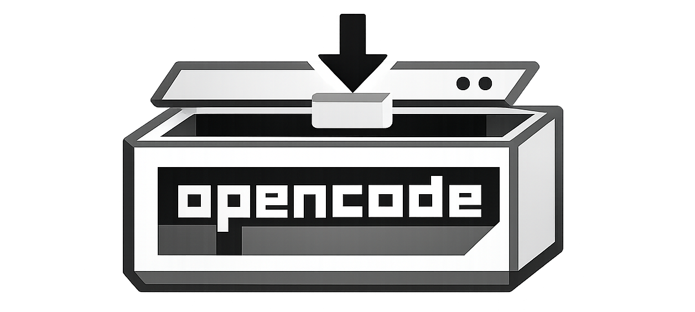

# opencode-vm

<sub><em>Run OpenCode inside an isolated Lima VM on macOS while keeping your normal host workflow (VS Code, Git, project files) fast and local. Maximum freedom for the AI agent (YOLO mode) — minimal risk for your personal development environment.</em></sub>




## Why this project?

- Isolation: OpenCode runs in a VM, not directly on host.
- Security: AI can only read & change your project files and opencode config - not the rest of your computer. Access the internet - not your local network except for chosen ports.
- Familiar workflow: edit/commit from host as usual.
- Fast startup: clone from a prepared base VM.
- Session hygiene: disposable session VMs.
- Practical defaults: host LLM ports and network policy support.

## Requirements

- macOS (Apple Silicon recommended)
- [Homebrew](https://brew.sh)

## Quick Start

1) Install opencode-vm (installs Lima automatically if Homebrew is available):

```bash
curl -fsSL https://raw.githubusercontent.com/GeektankLabs/opencode-vm/main/opencode-vm.sh -o opencode-vm.sh && bash opencode-vm.sh install
```

2) Reload your shell (if prompted by the installer):

```bash
source ~/.zshrc
```

3) Create the base VM (one-time):

```bash
opencode-vm init
```

4) Start from any project directory:

```bash
cd /path/to/project
opencode-vm start
```

or simply in your VS Code open terminal and type `opencode-vm start`

## Best Practices

The VM can run docker. So your AI agent can now start up your project in a docker container and run any tests and debug on it.

## Daily Usage

- See all the options:

```bash
opencode-vm
```

- Open additional shell into running project session:

```bash
opencode-vm shell
```

- Stop/clean old sessions:

```bash
opencode-vm prune
```

## Config & State Sync (important)

This project syncs OpenCode user data between local host and VM sessions, including:
- config (`~/.config/opencode/...`),
- data (`~/.local/share/opencode/...`),
- state (`~/.local/state/opencode/...`, e.g. model recents/favorites).

Result: model selection/favorites and related preferences persist across:
- local OpenCode ↔ VM sessions,
- repeated VM sessions.

First run without a local OpenCode setup is supported — missing host directories are created automatically.

## Network Policy Commands

Basic policy is: Your laptop can call the VM, but your VM can only call selected ports on your laptop .. for example to call Ollama or LMStudio.

Show policy:

```bash
opencode-vm ports show
```

Allow additional host ports from VM:

```bash
opencode-vm ports host add 8080
```

Allow specific LAN target from VM:

```bash
opencode-vm ports lan tcp add 192.168.178.10:443
```

If a docker container within the VM exposes a port its reachable from your laptops with: `localhost:[PORT]`

## Contributing

### Submitting Changes

After making local improvements to the script, generate a patch submission for upstream:

```bash
opencode-vm create-patch "short description of your change"
```

This fetches the current upstream script, computes a diff of your local changes (using intent-based 3-way merge by default), and outputs a ready-to-submit GitHub issue template. You can also use `--strategy=legacy` for a direct diff, or `export-patch` as an alias.

### Developer Setup

For active development on this project, clone the repository and symlink the script so changes are immediately reflected:

```bash
git clone https://github.com/GeektankLabs/opencode-vm.git
cd opencode-vm
mkdir -p "$HOME/bin"
rm -f "$HOME/bin/opencode-vm"
ln -sf "$PWD/opencode-vm.sh" "$HOME/bin/opencode-vm"
chmod +x "$HOME/bin/opencode-vm"
```

This creates a symbolic link from your `~/bin` directory to the script in your working copy, allowing you to edit and test changes without reinstalling.

To suppress the automatic update-available hint on every command, set `OCVM_DISABLE_UPDATE_CHECK=1`. To override the upstream URL used for updates and patches, set `OCVM_UPDATE_URL`.

## Useful Commands

```bash
opencode-vm install      # install/update script to ~/bin
opencode-vm init         # create/recreate base VM
opencode-vm              # start session (same as opencode-vm run)
opencode-vm shell        # shell into running project session
opencode-vm base         # shell into base VM
opencode-vm prune        # cleanup sessions, keep base
opencode-vm update       # update script from upstream
opencode-vm create-patch # generate a patch submission for upstream
```

To update OpenCode or system packages in the base VM, simply re-run `opencode-vm init`.
To update the opencode-vm script itself, run `opencode-vm update`.

## Best Practices (short)

- Run `opencode-vm` from the project root.
- Keep one active VM session per project directory.
- Re-run `opencode-vm init` to update OpenCode or system packages in the base VM.
- Keep your OpenCode provider endpoints stable (e.g. LM Studio/Ollama host ports).

## Desktop Share Directory

You can share files with the VM by creating a folder called `opencode-share` on your macOS Desktop:

```bash
mkdir ~/Desktop/opencode-share
```

When this folder exists at session start, it is automatically mounted into the VM at the same path. This is useful for quickly sharing screenshots, images, PDFs, or any other files that OpenCode should be able to access or work with — without placing them in your project repository.

If you need OpenCode to process a file (e.g. "describe this screenshot"), just drop it into `~/Desktop/opencode-share` and reference the path in your prompt. If you don't need this feature, simply don't create the folder — nothing changes.

## License

[MIT](LICENSE)
