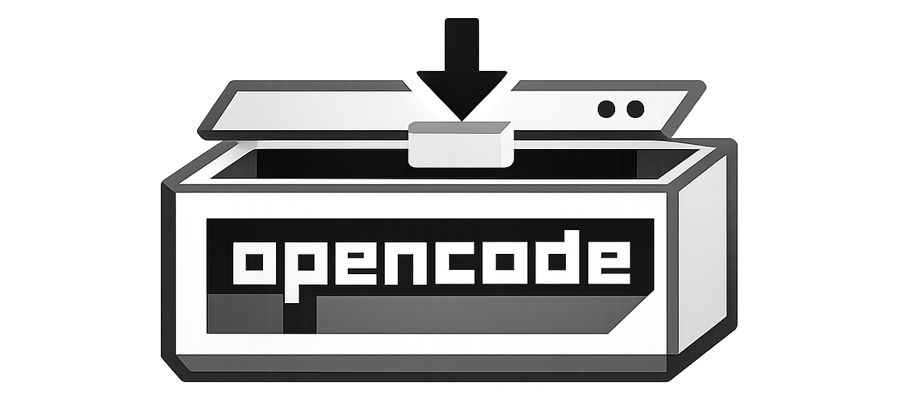

# opencode-vm

<sub><em>Run OpenCode inside an isolated Lima VM on macOS while keeping your normal host workflow (VS Code, Git, project files) fast and local. Maximum freedom for the AI agent (YOLO mode) — minimal risk for your personal development environment.</em></sub>




## Why this project?

OpenCode runs in a VM, not directly on host.

- System Isolation 
    - You share just project files, not your personal system & user space.
    - OpenCode cannot commit to origin git, so you have final control over your project.

- Network Isolation
    - The AI can access the internet to load rescources and research.
    - Not your host or local network (except for chosen ports).

- Familiar workflow
    - Start Opencode-VM in a terminal in VisualStudio Code with `opencode-vm start`
    - Let the AI start up docker containers in the VM on host ports (localhost:port)

## Requirements

- macOS (Apple Silicon recommended)
- [Homebrew](https://brew.sh)

## Quick Start

1) Install opencode-vm (installs Lima automatically if Homebrew is available):

```bash
curl -fsSL https://raw.githubusercontent.com/GeektankLabs/opencode-vm/main/opencode-vm.sh -o opencode-vm.sh && bash opencode-vm.sh install
```

2) Reload your shell (if prompted by the installer):

```bash
source ~/.zshrc
```

3) Create the base VM (one-time):

```bash
opencode-vm init
```

4) Start from any project directory:

```bash
cd /path/to/project
opencode-vm start
```

or simply in your VS Code open terminal and type `opencode-vm start`

## Best Practices

The VM can run docker. So your AI agent can now start up your project in a docker container and run any tests and debug on it.

## Daily Usage

- See all the options:

```bash
opencode-vm
```

- Open additional shell into running project session:

```bash
opencode-vm shell
```

If no session is running yet, `opencode-vm shell` now starts a fresh session automatically and opens the shell directly.

- Stop/clean old sessions:

```bash
opencode-vm prune
```

## ECC integration

Opencode-vm can pull the [everything-claude-code](https://github.com/affaan-m/everything-claude-code) plugin pack — a community collection of agents, commands, prompts, and skills — into every session. ECC is **implicit infrastructure**: there is no separate `ecc` subcommand. Activating an ECC skill package is all it takes.

```bash
opencode-vm skills on ecc-auto   # auto-clones ECC on first run, mounts language-filtered skills
opencode-vm skills on ecc-all    # every ECC skill (token-heavy)
opencode-vm skills off ecc-auto  # disable; ECC plugin payload stays off when no ecc-* skill is active
```

On `opencode-vm start` while an ECC skill is active, the `.opencode/` payload (commands, agents, plugins, tools) is copied into the session config, language-specific rules are appended to `AGENTS.md`, and the per-project learning store is mounted into the VM.

### Coding rules (auto-inject)

While ECC is active, opencode-vm auto-detects the languages of your project (via `go.mod`, `package.json`, `Cargo.toml`, `pyproject.toml`, `pom.xml`, etc.) and appends the matching per-language rule sets from ECC's `rules/` directory into the session's `AGENTS.md`. Covers ~15 languages; `common/` rules are always included.

**Monorepo support (`mcrepo.yaml`):** if the project root contains an `mcrepo.yaml` file with a `repos:` list, each listed repo's `name` is treated as a subdirectory and scanned individually in addition to the root. Results are merged.

### Persistent learning (per-project)

ECC's `continuous-learning-v2` skill (commands `/learn` and `/instinct-status`) builds up a per-project store of patterns the agent picks up during sessions. While any ECC skill is active, opencode-vm persists this store under `~/.opencode-vm/project-state/<hash>/homunculus/` and syncs it in/out of the session VM automatically.

`opencode-vm doctor` lists detected languages, applied rule files, and a summary of the learning store for the current working directory.

## Skills (opt-in, knowledge only)

opencode-vm splits extensions into two subsystems: **Skills** (knowledge packages — pure markdown mounted as agent context) and **MCPs** (server-based capabilities — tools the agent can actually call). This section covers Skills; MCPs are below.

The Skills subsystem is registry-driven: [`skills/registry.json`](skills/registry.json) is the source of truth. Four packages ship today:

| Package | Default | What it mounts | Approx. token cost |
|---|---|---|---|
| `webimg`      | on  | Web image optimization pipeline (tools pre-installed in base VM) | ~70 tokens |
| `ssh-toolkit` | on  | SSH/network workflows (tunnels, sshfs, discovery — tools pre-installed in base VM) | ~70 tokens |
| `ecc-auto`    | off | Universal ECC skills + language-specific matches for your project (≈30) | +2–4k tokens |
| `ecc-all`     | off | Every ECC skill (~180) | +10–15k tokens |

`ecc-auto` and `ecc-all` are mutually exclusive (enabling one auto-disables the other). Both auto-clone ECC into `~/.opencode-vm/ecc/` on first enable — no separate install step needed. `webimg` and `ssh-toolkit` are seeded as active on first use; you can disable them with `opencode-vm skills off <pkg>` if you don't need them.

**Why opt-in?** Each skill adds ~60–90 tokens of frontmatter to every new chat, whether you use it or not. `ecc-all` alone can push 10–15k tokens of pure menu noise — fine on a 200k-context remote model, painful on a 4k–32k local model.

```bash
opencode-vm skills                       # status (alias)
opencode-vm skills on ecc-auto           # enable the language-filtered package
opencode-vm skills on ecc-all            # enable everything (prints token warning)
opencode-vm skills off ecc-auto          # disable
opencode-vm skills list                  # preview what would mount for cwd (no VM touch)
opencode-vm skills list /path/to/other   # preview for another project path
```

`opencode-vm init` only provisions the base VM — every opt-in skill stays off until you explicitly run `opencode-vm skills on <pkg>`.

`opencode-vm doctor` shows active packages + per-package skill count for the current working directory, plus an estimated token total.

## MCPs (opt-in, capabilities)

MCPs (Model Context Protocol servers) give the agent *tools it can call* — browser automation, web search, codebase indexing, infrastructure APIs. Registry-driven at [`mcps/registry.json`](mcps/registry.json). Five MCPs ship today:

| MCP | Default | Needs setup | Description |
|---|---|---|---|
| `playwright` | on  | no | Headless browser automation (Chromium pre-installed in base VM) |
| `searxng`    | on  | no | Account-free metasearch (SearXNG container in base VM; aggregates Google/Bing/DuckDuckGo/Brave/Wikipedia) |
| `repomapper` | off | no | PageRank-ranked structural maps of the current codebase |
| `graphify`   | off | no | Code knowledge-graph (tree-sitter AST) — cross-file relationships, communities, god-nodes ([safishamsi/graphify](https://github.com/safishamsi/graphify)) |
| `proxmox`    | off | interactive host + API token | Proxmox VE API via [canvrno/ProxmoxMCP](https://github.com/canvrno/ProxmoxMCP) |

```bash
opencode-vm mcps                         # status
opencode-vm mcps list                    # show all MCPs with active/default markers
opencode-vm mcps on repomapper           # enable for future sessions
opencode-vm mcps off playwright          # disable (default-on MCPs can be turned off)
opencode-vm mcps on graphify             # enable graphify; first session prompts to build the graph
opencode-vm mcps purge graphify          # wipe per-project graph cache
opencode-vm mcps on proxmox              # interactive setup: host + API token, then ready
opencode-vm mcps off proxmox             # disable AND wipe stored credentials
```

Session MCP injection is data-driven: only MCPs in the active list end up in the session's `opencode.json`. Default-active MCPs are seeded into `~/.opencode-vm/mcps.env` on first use.

MCPs may also contribute an `agents_md_snippet` (in [`mcps/registry.json`](mcps/registry.json)) — a markdown block automatically appended to the session's `AGENTS.md` so the agent knows the MCP is available without you needing to nudge it. The composition is sidecar-style: host writes `$sess_share/config/opencode/AGENTS.mcps.md`, the VM-side AGENTS.md build cats it after the Host LAN IP block. Active-list changes propagate on the next session start; deactivated MCPs are silently dropped.

### Graphify MCP

[`graphify`](https://github.com/safishamsi/graphify) builds a tree-sitter-based knowledge graph of your codebase and exposes 7 read-only query tools (`query_graph`, `get_node`, `get_neighbors`, `get_community`, `god_nodes`, `graph_stats`, `shortest_path`). The MCP server itself makes **zero LLM calls** — semantic enrichment of non-code content (docs, papers, images) happens through the agent, which uses your already-configured opencode provider. **No separate API key is needed.**

The graph file is persisted per-project at `~/.opencode-vm/project-state/<hash>/graphify/graph.json` and survives session resets. On first activation in a fresh project the wrapper returns a "no graph" message — build the graph with the `graphify` CLI inside the session VM (`graphify --help` to see the current subcommands). Use `opencode-vm mcps purge graphify` to wipe the cached graph.

### Proxmox MCP

`opencode-vm mcps on proxmox` walks you through an interactive prompt for host, port, user, API token name, token value, and TLS verification — saved to `~/.opencode-vm/proxmox.env` (mode 0600). On the next `opencode-vm start`, the MCP server is installed into the base VM (one-time, ~30 s) and exposed in the session. A companion SKILL.md (safe defaults, common tasks, API-token guide) is mounted alongside.

To **rotate the token** or **change the host**: `opencode-vm mcps off proxmox` (wipes credentials) then `opencode-vm mcps on proxmox` (re-prompts).

Token-creation cheat sheet: in the PVE UI, **Datacenter → Permissions → Users → Add `automation@pve`**, then **API Tokens → Add `automation@pve!claude`** (privilege separation off), and finally **Permissions → Add → Path `/`, User `automation@pve`, Role `PVEAdmin`** (narrow the role/path later for least privilege).

## Web Mode

Instead of running OpenCode as a terminal TUI inside the VM, you can start it as a web server. This gives you browser-based access — including from your phone or tablet on the same network.

```bash
opencode-vm web
```

This starts OpenCode's web server inside the VM and prints connection URLs using your host's local IP address. By default it uses port 4096.

What you get from a single command:

- **Web UI** — full OpenCode interface in your browser
- **REST API** — programmatic access with OpenAPI docs at `/doc`
- **TUI attach** — connect a terminal TUI from the host via `opencode attach http://<ip>:4097`
- **A2A agent** — the same OpenCode, drivable by an A2A 1.0 orchestrator

All clients share the same sessions and state, so you can switch between browser, terminal and orchestrator seamlessly.

### Port layout

A web session owns a small contiguous block around the base port `P` you pass to `--port`:

| Port | Service | On the LAN? |
|---|---|---|
| `P-2` | `opencode-a2a` | no — VM loopback only |
| `P-1` | OpenCode backend | no — VM loopback only |
| `P` | Web UI / REST, **HTTPS** | yes |
| `P+1` | Web UI / REST, **HTTP** | yes |
| `P+2` | A2A, **HTTPS** | yes |
| `P+3` | A2A, **HTTP** | yes |

With the default `--port 4096` that is `4094`–`4099`. Valid base ports are `1026`–`65532`.

The offsets are a fixed contract, because the A2A agent card has to advertise an absolute URL. If any port in the block is taken, the **whole block** moves to the next free one — the relationships never drift apart. The host port and the VM port are always the same number.

The plain-HTTP twins exist for clients that cannot be taught to trust the session's self-signed certificate — OpenCode Desktop, `opencode attach`, and most A2A clients. They are exposed on the LAN on purpose; use them only on a network you trust.

### A2A

Every web session also runs [`opencode-a2a`](https://github.com/Intelligent-Internet/opencode-a2a) as a sidecar, pinned and installed into the base VM. It talks to the *same* OpenCode process over VM loopback — there is no second runtime, and A2A tasks land in the same sessions and the same workspace the browser sees.

```
Agent Card:  http://<ip>:4099/.well-known/agent-card.json
```

The card advertises the **HTTP** endpoint deliberately: `opencode-a2a` bakes exactly one public URL into the card at startup, and a client that cannot verify our self-signed certificate would otherwise be redirected somewhere it cannot reach. Both endpoints front the same process.

**A2A always requires a credential** — `opencode-a2a` refuses to start without one. So:

- with `--password PW`, all four public endpoints use those credentials (Basic for web/REST, Basic *or* Bearer for A2A);
- without one, A2A uses the fixed default `opencode-vm`, which is printed in the startup banner. It is a documented constant, not a secret — a hidden generated token would be worse, since nobody could find it and it would rotate on every restart.

Both a Basic and a Bearer credential are registered, because A2A clients differ in what they send. Example for an orchestrator that speaks Bearer:

```yaml
a2a_agents:
  - url: http://192.168.1.20:4099
    auth: { type: bearer, token: opencode-vm }
```

The adapter is confined to the project the VM was started in: directory override is disabled, as are session shell and workspace mutations. It reaches OpenCode over loopback only, and the VM's existing firewall already blocks outbound access to your LAN.

Opt out with `--no-a2a` (or `OCVM_A2A=0`). By default a sidecar that fails to start is a loud warning and the web UI keeps running; `--require-a2a` makes it fatal instead.

### Passwords

`--password PW` protects every public endpoint with HTTP Basic (username `opencode`). The secret is stored per session at `~/.opencode-vm/sessions/<hash>/auth.env` with mode `0600`, so `opencode-vm attach` resumes a protected session as protected — it previously came back wide open. It is never printed, never written to `session.env`, and never passed on a command line. `--no-auth` removes a stored password; `$OCVM_WEB_PASSWORD` sets one without it appearing in your shell history.

**About the entry URL.** Use the short root URL exactly as printed — it is the one that makes everything work.

OpenCode's web UI opens a project only through the route `/<base64url(path)>`, and it keeps the list of known projects in browser-local storage. A browser that has never seen this server therefore reaches no project at all. Worse, the UI asks the server for *every* session and then filters the answer against that same local project list — so on a second machine the chat sessions you started elsewhere are fetched but discarded, and the view looks empty.

A small redirector inside the VM handles this. It sits on the port the tunnel forwards to and, for browser navigation to `/`, serves a one-line bootstrap page that:

- registers this server's project in the browser, which is what makes **all chat sessions of the project visible on every device** that opens the URL;
- sets first-run defaults — dark color scheme, visible agent switcher, visible session sidebar — and suppresses the onboarding overlay that otherwise covers the interface;
- forwards into the project.

Each of those is written **only if the key is still absent**, so anything you change later is never overwritten. The project entry is merged into an existing list rather than replacing it.

Everything other than that one navigation is passed through untouched as raw TCP, so the SSE event stream, assets and the REST API are unaffected. The bootstrap is gated on `Accept: text/html`, so `curl`, the REST API and `opencode attach` still see the real root. If the redirector cannot start, opencode serves the port directly and the printed `Direct project:` link still works.

Options:

```bash
opencode-vm web --port 3000         # use a custom port (reserves 2998-3003)
opencode-vm web --password secret   # protect all four public endpoints
opencode-vm web --no-auth           # drop a previously stored password
opencode-vm web --no-tls            # serve plain HTTP instead of HTTPS
opencode-vm web --no-a2a            # web only, no A2A sidecar
opencode-vm web --require-a2a       # fail the session if A2A is not ready
opencode-vm web --tui               # also start TUI in terminal (experimental)
```

The `--tui` flag starts the web server in the background, then lets you press Enter to launch a terminal TUI that connects to the same server — giving you both interfaces at once.

### HTTPS by default, and why (`--no-tls`)

`opencode-vm web` serves **HTTPS** by default, using a self-signed certificate generated inside the VM.

The reason is attachments. OpenCode's web UI hashes them through `crypto.subtle`, and browsers expose the Web Crypto API **only to secure contexts**. Over a plain-HTTP LAN address that API is `undefined`, so the "Add images and files" button opens the file dialog, accepts your selection, and then silently produces nothing — no preview, no attachment. That is an open OpenCode bug ([#11452](https://github.com/anomalyco/opencode/issues/11452), [#12989](https://github.com/anomalyco/opencode/issues/12989)) which the server cannot work around from its side; serving a secure origin is what fixes it.

Each device shows a certificate warning once and then keeps trusting it: the certificate lives per project under the session share and is reused, regenerated only when your host IP changes or it nears expiry. It covers your host's LAN IP, `127.0.0.1` and `localhost`.

TLS is terminated in the redirector and affects the browser path only. opencode itself keeps serving plain HTTP on a VM-internal loopback port, and the banner points `opencode attach` and REST clients there, so they never have to trust the certificate. The setting is remembered in the session record, so `opencode-vm attach` resumes an HTTPS session as HTTPS.

Plain `http://` requests to the HTTPS port are answered with a redirect to `https://` instead of a failed handshake, so mistyping the scheme no longer produces a browser error page.

Start with `--no-tls` when you want plain HTTP — for example for an API client that should talk to `http://<ip>:4096` directly. Attachments then only work through the printed `Loopback also:` URL, because `127.0.0.1` counts as a secure context on its own. If `openssl` is missing or the certificate cannot be generated, opencode-vm says so and falls back to plain HTTP by itself.

### Browser defaults

The bootstrap page seeds these on a browser's first visit to the root URL, and never touches them again:

| Setting | Seeded value | Why |
|---|---|---|
| Known project | this server's worktree | without it the UI filters every chat session out of the view |
| Color scheme | `dark` | opencode defaults to following the OS |
| Show agent | on | the composer otherwise hides the agent selector and silently uses Build |
| Session sidebar | on | this is where the project's chat sessions are listed |
| Onboarding overlay | dismissed | it otherwise covers the interface on first load |

To change any of them afterwards use **Settings → General** (or the theme command) — your choice wins from then on. Note that `http://<lan-ip>:4096`, `https://<lan-ip>:4096` and `https://127.0.0.1:4096` are separate origins as far as the browser is concerned, each with its own copy of these preferences.

### Web-UI Attachments (the "+" upload button)

OpenCode's web UI lets you attach a file to a message with the "+" button. Under the hood the upload is inlined as a base64 `data:` URI into the message JSON — which means the model can *see* an image (when it's vision-capable), but the agent's tools (Read, Bash, ImageMagick, `pdftotext`, MCPs, …) can't open it as a real file.

opencode-vm runs a small `ocvm-materialize` daemon inside every **web-mode** session that watches OpenCode's session storage and writes each `data:`-URI upload to disk. The agent is informed about the location via `AGENTS.md` and can simply use the real path with any tool:

- **Where:** `$OCVM_ATTACHMENTS_DIR` — a subpath of the session share, one subfolder per OpenCode session id, with an `index.json` that maps part-IDs to filenames.
- **When:** active only in `opencode-vm web` (and on `opencode-vm attach` to a web session). TUI sessions don't have a "+" upload path.
- **Lifetime:** ephemeral — the directory is wiped at session end. Files do **not** survive `--keep-history`.
- **Disable:** set `OCVM_MATERIALIZE=0` in your environment before `opencode-vm web` to turn the daemon off entirely.

You can inspect daemon state via `opencode-vm doctor` (section *Web-UI Attachments*).

## Config & State Sync (important)

This project syncs OpenCode user data between local host and VM sessions, including:
- config (`~/.config/opencode/...`),
- data (`~/.local/share/opencode/...`),
- state (`~/.local/state/opencode/...`, e.g. model recents/favorites).

Result: model selection/favorites and related preferences persist across:
- local OpenCode ↔ VM sessions,
- repeated VM sessions.

First run without a local OpenCode setup is supported — missing host directories are created automatically.

You can inspect synced provider/auth/model/database state at any time:

```bash
opencode-vm doctor
```

This reports, among other things:
- providers connected via `/connect` (from `auth.json`),
- recent/favorite provider+model selections (from `model.json`),
- provider usage markers found in `opencode.db` message metadata.

## Per-Project VM Sizing (RAM + CPUs)

Every session VM is a clone of the shared base VM and inherits its **8 GiB / 6 CPUs**. A project that needs more (large builds, heavy test suites, local models) can carry its own size:

```bash
cd /path/to/heavy-project
opencode-vm ram 32        # remembered for this project
opencode-vm cpu 12        # likewise
opencode-vm ram show      # full picture (both commands print the same table)
opencode-vm ram default   # drop just the RAM override
opencode-vm cpu default   # drop just the CPU override
```

`show` always reports both resources next to what the machine actually has:

```
Project:  /path/to/heavy-project
Setting:  /Users/you/.opencode-vm/project-state/a4488b22.../vm.env

  Resource   This project     Default    Host total
  RAM        32 GiB (set)     8 GiB      128 GiB
  CPUs       12 (set)         6          18

  Session VM oc-20260722-235140: 8 GiB, 6 CPUs
    -> differs from the table above; applied on the next VM start.

Set:    opencode-vm ram <GiB>        opencode-vm cpu <N>
Reset:  opencode-vm ram default      opencode-vm cpu default
```

How it behaves:

- The settings are **per project**, keyed by project path, and stored on the host at `~/.opencode-vm/project-state/<hash>/vm.env` — not in your repo, so they never reach the VM's mount and never show up in `git status`.
- They are applied when the session VM is **cloned**, and re-applied when a kept VM is **resumed** (`start` / `attach`), so they survive across sessions without an `init`.
- The **base VM is never modified**. One heavyweight project cannot inflate every other project's VM.
- Every `start` prints a reminder while an override is active, together with how to change or clear it:

  ```
  [run] Sizing override for this project: 32 GiB RAM, 12 CPUs (defaults: 8 GiB, 6 CPUs)
  [run]   change: 'opencode-vm ram <GiB>' / 'opencode-vm cpu <N>'   reset: append 'default'
  ```

- RAM and CPUs are independent: clearing one leaves the other in place.
- A **running** VM cannot be resized. Change the setting, exit the session, and the next `start` applies it — the commands tell you when that is the case.
- Accepted ranges: RAM from 2 GiB, CPUs from 1, each capped at what the host physically has. Anything above 75% of the host total is flagged as a warning but allowed.

## Provider Commands

Provider management is a first-class top-level command — no `doctor` prefix needed:

```bash
opencode-vm provider list
opencode-vm provider new                 # interactive wizard
opencode-vm provider refresh <id>        # re-discover models for an existing provider
opencode-vm provider rm <provider-id> [--dry-run]
```

**Model discovery:** When no `--model` flags are given, `provider add` automatically calls the `/models` endpoint and adds all returned models. If the endpoint is unreachable or returns no models, the provider is **not** added. Pass `--model` flags explicitly to skip auto-discovery. Where available (e.g. LM Studio), the context window size is read from the API and stored automatically.

**`provider refresh` and session-start auto-refresh:** Once a provider exists, `opencode-vm provider refresh <id>` re-queries `/v1/models` and reconciles the model list — new models are added (auto-tagged for vision/reasoning where the heuristics or `/v1/models` metadata is conclusive), removed models are dropped, and existing per-model flags (`vision`, `reasoning`, `output`) are **preserved verbatim**. Flags: `--prompt-new` (interactive accept/edit/skip per new model), `--skip-new` (drop new models silently), `--no-context-update` (don't touch context windows of existing models), `--dry-run`, `--quiet`.

The same refresh runs **automatically on every `opencode-vm start`** for providers that target a host-local endpoint (`localhost`, `127.0.0.1`, `192.168.5.2`, or `host.lima.internal`) — so a model you just loaded into LM Studio or Ollama shows up in the next session without you doing anything. Cloud providers (OpenAI, Anthropic, etc.) are skipped to avoid per-session API noise. Set `OCVM_PROVIDER_AUTOREFRESH=0` to disable. Failures are non-fatal — a stopped LM Studio just keeps yesterday's model list.

**`--model` flag** (repeatable) — `id[:name[:context_tokens]]`:
- `--model gpt-4o` — ID and display name both `gpt-4o`, no context limit stored
- `--model gpt-4o:GPT-4o` — ID `gpt-4o`, display name `GPT-4o`
- `--model gpt-4o:GPT-4o:128000` — additionally stores context window of 128k tokens

**`--vision` flag** — marks all models of this provider as supporting image/vision input. This enables the image upload button in OpenCode and allows sending screenshots or images to the model. Required for Playwright/screenshot workflows. The interactive wizard (`provider new`) will ask about this.

**`--reasoning` flag** — enables extended reasoning/thinking for all models (`options.thinking.type: "enabled", budgetTokens: 8192`). OpenCode gates reasoning behavior based on this flag — without it, the model will not use extended thinking even if it supports it. The wizard will ask about this.

> **Note on missing context (`Kontextlimit 0`):** A context limit of 0 means OpenCode skips compaction and overflow protection entirely. For long sessions this can cause API errors when the model's real context window is exceeded. Always set a context limit, either via auto-discovery or `--model id:name:TOKENS`.

**Real world examples:**

```bash
# 1) Fully interactive wizard (prompts for ID, URL, key, name, then auto-discovers models)
opencode-vm provider new

# 2) Local LM Studio — auto-discovers models from http://localhost:1234/v1/models
opencode-vm provider add lmstudio-local \
    --base-url http://localhost:1234/v1 \
    --api-key local \
    --name "LM Studio (host local)"

# 3) Local Ollama — auto-discovers models from http://localhost:11434/v1/models
opencode-vm provider add ollama-local \
    --base-url http://localhost:11434/v1 \
    --api-key local \
    --name "Ollama (host local)"

# 4) OpenRouter — auto-discovers all available models
opencode-vm provider add openrouter-custom \
    --base-url https://openrouter.ai/api/v1 \
    --api-key sk-or-v1-xxxx \
    --name "OpenRouter"

# 5) Self-hosted gateway with explicit model list + context limits + vision
opencode-vm provider add ai-gateway \
    --base-url https://ai.example.com/v1 \
    --api-key your-token \
    --name "Company AI Gateway" \
    --model "llama-3.1-70b:Llama 3.1 70B:131072" \
    --model "mistral-7b:Mistral 7B:32768" \
    --vision

# 6) Safe preview first (auto-discovers but writes nothing)
opencode-vm provider add myprovider \
    --base-url https://api.example.com/v1 \
    --api-key test-key \
    --dry-run

# 7) Remove a provider (cleans auth, config, model state, db metadata)
opencode-vm provider rm lmstudio-local --dry-run
opencode-vm provider rm lmstudio-local
```

After adding/updating a provider, restart the session so OpenCode reloads config/auth:

```bash
opencode-vm prune
opencode-vm start
```

Backups are created in `~/.opencode-vm/backups/provider-<timestamp>/` before each change.

## Network Policy Commands

Basic policy is: Your laptop can call the VM, but your VM can only call selected ports on your laptop .. for example to call Ollama or LMStudio.

By default, host ports `1234` (LM Studio) and `11434` (Ollama) are allowed and automatically forwarded inside the VM to `localhost`. That means these work inside the VM without extra setup:

```bash
curl http://localhost:1234/v1/models
curl http://localhost:11434/api/tags
```

Direct host access still works via `host.lima.internal`.

Show policy:

```bash
opencode-vm ports show
```

Allow additional host ports from VM:

```bash
opencode-vm ports host add 8080
```

Control localhost forwarding behavior:

```bash
opencode-vm ports hostfwd show
opencode-vm ports hostfwd enable
opencode-vm ports hostfwd disable
```

Allow LAN targets from VM (single hosts **or whole subnets**):

```bash
opencode-vm ports lan tcp add 192.168.178.10:443   # one host, one port
opencode-vm ports lan tcp add 192.168.19.10        # one host, all TCP ports
opencode-vm ports lan tcp add 192.168.19.0/24      # whole /24 subnet
opencode-vm ports lan tcp add 192.168.19.*         # same /24, wildcard form
opencode-vm ports lan udp add 192.168.19.0/24:53   # UDP is configured separately
opencode-vm ports lan tcp rm  192.168.19.*         # remove again
opencode-vm ports lan tcp clear                    # drop the whole TCP allowlist
```

Accepted input forms (all normalized to CIDR notation internally, so `ports show`
will display e.g. `192.168.19.0/24`):

| Input | Means |
|---|---|
| `192.168.19.10` | single host, all ports |
| `192.168.19.10:443` | single host, port 443 only |
| `192.168.19.0/24` | whole subnet, all ports |
| `192.168.19.0/24:443` | whole subnet, port 443 only |
| `192.168.19.*` | whole `192.168.19.0/24` |
| `192.168.*.*` | whole `192.168.0.0/16` |
| `10.*` | whole `10.0.0.0/8` |

Notes:

- The policy lives in `~/.opencode-vm/policy.env` and is **global — it applies to
  every OpenCode VM instance**. Changes are pushed to all running sessions
  immediately (no restart needed); for an instance not yet started they take
  effect on the next `opencode-vm start`.
- TCP and UDP are separate lists — add an entry to both if you need both.
- Quote wildcard forms so your shell doesn't expand `*` against the current
  directory: `opencode-vm ports lan tcp add '192.168.19.*'` (or just use the
  equivalent CIDR `192.168.19.0/24`, which needs no quoting).
- Invalid input (e.g. `192.168.19`, an octet > 255, or a wildcard that isn't
  trailing like `192.*.19.*`) is rejected with an error and nothing is saved.
- Overlapping entries are fine: if you add a subnet that already covers single
  hosts you listed (e.g. `192.168.19.132` plus `192.168.19.0/24`), the redundant
  host entries are automatically dropped when the policy is pushed into the VM —
  the firewall only ever sees the widest covering block per port.

If a docker container within the VM exposes a port its reachable from your laptops with: `localhost:[PORT]`

## Contributing

### Submitting Changes

After making local improvements to the script, generate a patch submission for upstream:

```bash
opencode-vm create-patch "short description of your change"
```

This fetches the current upstream script, computes a diff of your local changes (using intent-based 3-way merge by default), and outputs a ready-to-submit GitHub issue template. You can also use `--strategy=legacy` for a direct diff, or `export-patch` as an alias.

### Developer Setup

For active development on this project, clone the repository and symlink the script so changes are immediately reflected:

```bash
git clone https://github.com/GeektankLabs/opencode-vm.git
cd opencode-vm
mkdir -p "$HOME/bin"
rm -f "$HOME/bin/opencode-vm"
ln -sf "$PWD/opencode-vm.sh" "$HOME/bin/opencode-vm"
chmod +x "$HOME/bin/opencode-vm"
```

This creates a symbolic link from your `~/bin` directory to the script in your working copy, allowing you to edit and test changes without reinstalling.

#### Add `~/bin` to your PATH

If `opencode-vm` is not found after symlinking, make sure your local `~/bin` is in your shell `PATH`.

For macOS default shell (`zsh`):

```bash
echo 'export PATH="$HOME/bin:$PATH"' >> ~/.zshrc
source ~/.zshrc
```

For `bash`:

```bash
echo 'export PATH="$HOME/bin:$PATH"' >> ~/.bashrc
source ~/.bashrc
```

Optional: if you prefer to hide the update-available hint on each command, set `OCVM_DISABLE_UPDATE_CHECK=1`. If you want updates and patch generation to use a different upstream, set `OCVM_UPDATE_URL`.

## Useful Commands

```bash
opencode-vm install      # install/update script to ~/bin
opencode-vm init         # create/recreate base VM
opencode-vm skills on ecc-auto             # opt into ECC skills (auto-clones ECC on first run)
opencode-vm mcps on proxmox                # opt into Proxmox MCP (interactive credential prompt)
opencode-vm mcps list                      # show all MCPs + their active state
opencode-vm start        # start TUI session (same as opencode-vm run)
opencode-vm web          # start web server session (browser, API, TUI attach)
opencode-vm attach       # reconnect to a running/kept session (e.g. after a terminal crash)
opencode-vm shell        # shell into session VM (auto-starts if none is running)
opencode-vm base         # shell into base VM
opencode-vm prune        # cleanup sessions, keep base
opencode-vm ram show     # per-project VM sizing + host totals (run inside the project)
opencode-vm ram 16       # give this project 16 GiB — remembered across sessions
opencode-vm cpu 12       # give this project 12 CPUs — remembered across sessions
opencode-vm ram default  # drop the RAM override (8 GiB); 'cpu default' likewise (6 CPUs)
opencode-vm ports show   # show host/LAN policy and localhost-forwarding status
opencode-vm doctor       # inspect synced local auth/model/db state
opencode-vm provider list
opencode-vm provider add <id> --base-url <url> --api-key <key> [--name "Display Name"] [--dry-run]
opencode-vm provider rm <id> [--dry-run]
opencode-vm auth status  # show OAuth token freshness across VMs/sessions
opencode-vm auth resync  # adopt the freshest OAuth token into the host auth.json
                         #   (fix for "401 token refresh failed" across VMs)
opencode-vm screenshot   # setup guide for browser screenshot capture
opencode-vm update       # update script from upstream
opencode-vm create-patch # generate a patch submission for upstream
```

### Advanced environment variables

All optional; the defaults are the documented behavior.

| Variable | Default | Effect |
|---|---|---|
| `OCVM_ON_EXIT` | `ask` (`keep` for non-TTY) | Session-end action: `keep`, `delete`, or `ask` |
| `OCVM_AUTH_AUTORESYNC` | `1` | OAuth freshest-token pre-flight before start/attach (`0` disables) |
| `OCVM_PROVIDER_AUTOREFRESH` | `1` | Auto-refresh local LM Studio/Ollama providers at session start (`0` disables) |
| `OCVM_MODEL_ENRICH` | `1` | Backfill context/output/vision/reasoning metadata for known frontier models (`0` disables) |
| `OCVM_MODEL_ENRICH_PROVIDERS` | auto | Comma-separated provider ids to enrich (default: openai-compatible + ai-gateway) |
| `OCVM_REASONING_EFFORT` | `medium` | `reasoningEffort` injected for openai-compatible reasoning models |
| `OCVM_REASONING_BUDGET` | `8192` | `thinking.budgetTokens` injected for native reasoning models |
| `OCVM_HOST_LAN_IP` | auto-detect | Override the host LAN IP announced to the VM/web UI |
| `OCVM_DISABLE_UPDATE_CHECK` | unset | `1` hides the update-available hint |
| `OCVM_UPDATE_URL` | GitHub upstream | Alternative raw URL for self-update and patch generation |

To update OpenCode or system packages in the base VM, simply re-run `opencode-vm init`.
To update the opencode-vm script itself, run `opencode-vm update`.

## Upgrading to 0.5.0

0.5.0 is a cleanup/hardening release. Breaking changes:

- **Pre-0.4.x state migrations removed.** The one-shot shims (proxmox-as-skill state, project-history seeding, searxng auto-enable, legacy `.opencode.json` project-state shadowing) are gone. If you upgrade from a very old version (pre-0.4.4), go through the latest 0.4.x first — or simply re-run `opencode-vm init` and re-enable your skills/MCPs.
- **Legacy env-var aliases removed:** `OCVM_MODEL_LIMIT_FALLBACK` → `OCVM_MODEL_ENRICH`, `OCVM_MODEL_LIMIT_PROVIDERS` → `OCVM_MODEL_ENRICH_PROVIDERS`.
- **`ports host add/set` now validates ports** (integers 1–65535 only) and invalid `HOST_TCP_PORTS` entries in a hand-edited `policy.env` are ignored with a warning. `policy.env` and `proxmox.env` are now written shell-escaped.

Recommended after updating: `opencode-vm init` to rebuild the base VM.

## Best Practices (short)

- Run `opencode-vm` from the project root.
- Keep one active VM session per project directory.
- Re-run `opencode-vm init` to update OpenCode or system packages in the base VM.
- Keep your OpenCode provider endpoints stable (e.g. LM Studio/Ollama host ports).

## Desktop Share Directory

You can share files with the VM by creating a folder called `opencode-share` on your macOS Desktop:

```bash
mkdir ~/Desktop/opencode-share
```

When this folder exists at session start, it is automatically mounted into the VM at the same path. This is useful for quickly sharing screenshots, images, PDFs, or any other files that OpenCode should be able to access or work with — without placing them in your project repository.

If you need OpenCode to process a file (e.g. "describe this screenshot"), just drop it into `~/Desktop/opencode-share` and reference the path in your prompt. If you don't need this feature, simply don't create the folder — nothing changes.

## License

[MIT](LICENSE)
