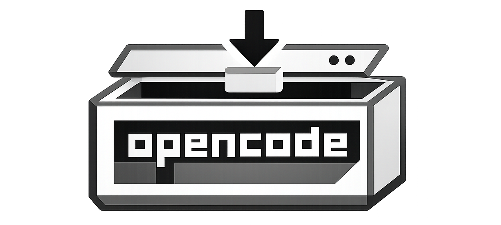
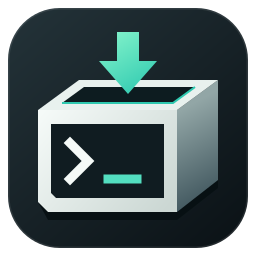

# opencode-vm

<sub><em>Run OpenCode inside an isolated Lima VM on macOS while keeping your normal host workflow (VS Code, Git, project files) fast and local. Maximum freedom for the AI agent (YOLO mode) — minimal risk for your personal development environment.</em></sub>




## Why this project?

OpenCode runs in a VM, not directly on host.

- System Isolation 
    - You share just project files, not your personal system & user space.
    - OpenCode cannot commit to origin git, so you have final control over your project.

- Network Isolation
    - The AI can access the internet to load rescources and research.
    - Not your host or local network (except for chosen ports).

- Familiar workflow
    - Start Opencode-VM in a terminal in VisualStudio Code with `opencode-vm start`
    - Let the AI start up docker containers in the VM on host ports (localhost:port)

## Requirements

- macOS (Apple Silicon recommended)
- [Homebrew](https://brew.sh)

## Quick Start

1) Install opencode-vm (installs Lima automatically if Homebrew is available):

```bash
curl -fsSL https://raw.githubusercontent.com/GeektankLabs/opencode-vm/main/opencode-vm.sh -o opencode-vm.sh && bash opencode-vm.sh install
```

2) Reload your shell (if prompted by the installer):

```bash
source ~/.zshrc
```

3) Create the base VM (one-time):

```bash
opencode-vm init
```

4) Start from any project directory:

```bash
cd /path/to/project
opencode-vm start
```

or simply in your VS Code open terminal and type `opencode-vm start`

## Best Practices

The VM can run docker. So your AI agent can now start up your project in a docker container and run any tests and debug on it.

### VS Code Workspace Trust

`opencode-vm start`, `web`, `attach`, and `shell` check the saved Workspace Trust state of the standard macOS VS Code Stable installation before sharing a project. If the project is trusted, OpenCode VM explains how to switch VS Code to Restricted Mode and returns to your terminal. After changing the setting, rerun the OpenCode VM command; the check runs again.

Restricted Mode still permits browsing and editing, but limits tasks, debugging, sensitive workspace settings, and extensions that could execute agent-modified project content on your Mac. Run builds, tests, and project tooling in the VM while the project is restricted on the host.

You can deliberately continue without changing VS Code and remember that decision for one project. The choice is host-only at `~/.opencode-vm/project-state/<project-hash>/vscode-trust.json`; it never changes VS Code settings. Inspect or remove it from the project directory with:

```bash
opencode-vm vscode-trust status
opencode-vm vscode-trust reset
```

The check reads VS Code's saved state only. It does not modify VS Code and cannot verify the live state of an already-open VS Code window, custom VS Code user-data directories, or other VS Code distributions.

## Daily Usage

- See all the options:

```bash
opencode-vm
```

- Open additional shell into running project session:

```bash
opencode-vm shell
```

If no session is running yet, `opencode-vm shell` now starts a fresh session automatically and opens the shell directly.

- Stop/clean old sessions:

```bash
opencode-vm prune
```

## ECC integration

Opencode-vm can pull the [everything-claude-code](https://github.com/affaan-m/everything-claude-code) plugin pack — a community collection of agents, commands, prompts, and skills — into every session. ECC is **implicit infrastructure**: there is no separate `ecc` subcommand. Activating an ECC skill package is all it takes.

```bash
opencode-vm skills on ecc-auto   # auto-clones ECC on first run, mounts language-filtered skills
opencode-vm skills on ecc-all    # every ECC skill (token-heavy)
opencode-vm skills off ecc-auto  # disable; ECC plugin payload stays off when no ecc-* skill is active
```

On `opencode-vm start` while an ECC skill is active, the `.opencode/` payload (commands, agents, plugins, tools) is copied into the session config and the per-project learning store is mounted into the VM.

### Language detection (skill filtering)

The `ecc-auto` package auto-detects the languages of your project (via `go.mod`, `package.json`, `Cargo.toml`, `pyproject.toml`, `pom.xml`, etc.) and mounts only the matching ECC skills.

**Monorepo support (`mcrepo.yaml`):** if the project root contains an `mcrepo.yaml` file with a `repos:` list, each listed repo's `name` is treated as a subdirectory and scanned individually in addition to the root. Results are merged.

### Persistent learning (per-project)

ECC's `continuous-learning-v2` skill (commands `/learn` and `/instinct-status`) builds up a per-project store of patterns the agent picks up during sessions. While any ECC skill is active, opencode-vm persists this store under `~/.opencode-vm/project-state/<hash>/homunculus/` and syncs it in/out of the session VM automatically.

`opencode-vm doctor` shows a summary of the learning store for the current working directory.

## Skills (knowledge only)

opencode-vm splits extensions into two subsystems: **Skills** (knowledge packages — pure markdown mounted as agent context) and **MCPs** (server-based capabilities — tools the agent can actually call). This section covers Skills; MCPs are below.

The Skills subsystem is registry-driven: [`skills/registry.json`](skills/registry.json) is the source of truth. Five packages ship today:

| Package | Default | What it mounts | Approx. token cost |
|---|---|---|---|
| `besprechung` | on | Session-aware review documents, guided dialogues, and two slash commands | ~70 tokens |
| `webimg`      | on  | Web image optimization pipeline (tools pre-installed in base VM) | ~70 tokens |
| `ssh-toolkit` | on  | SSH/network workflows (tunnels, sshfs, discovery — tools pre-installed in base VM) | ~70 tokens |
| `ecc-auto`    | off | Universal ECC skills + language-specific matches for your project (≈30) | +2–4k tokens |
| `ecc-all`     | off | Every ECC skill (~180) | +10–15k tokens |

`ecc-auto` and `ecc-all` are mutually exclusive (enabling one auto-disables the other). Both auto-clone ECC into `~/.opencode-vm/ecc/` on first enable — no separate install step needed. `besprechung`, `webimg`, and `ssh-toolkit` are seeded as active on first use; existing installations receive `besprechung` once during the update migration. You can disable any of them with `opencode-vm skills off <pkg>`. A later update does not re-enable a package that was deliberately disabled after that migration.

**Why configurable?** Each skill adds ~60–90 tokens of frontmatter to every new chat, whether you use it or not. `ecc-all` alone can push 10–15k tokens of pure menu noise — fine on a 200k-context remote model, painful on a 4k–32k local model.

```bash
opencode-vm skills                       # status (alias)
opencode-vm skills on ecc-auto           # enable the language-filtered package
opencode-vm skills on ecc-all            # enable everything (prints token warning)
opencode-vm skills off ecc-auto          # disable
opencode-vm skills list                  # preview what would mount for cwd (no VM touch)
opencode-vm skills list /path/to/other   # preview for another project path
```

The `besprechung` package adds two commands to every new session:

```text
/besprechung [optional focus]         # complete, copyable discussion document
/besprechung-dialog [optional focus]  # guided, turn-based discussion
```

Both commands reconstruct the relevant current session state instead of producing a chronological chat summary. The document form is optimized for reading aloud and transfer to another system. The dialogue form explains one main point at a time, handles follow-up questions, and asks only decisions that can materially change the work. Neither form treats discussion as an instruction to continue implementation.

After an `opencode-vm update`, restart the affected OpenCode session. Fresh starts and reconnects (`opencode-vm attach` or `--reconnect`) both refresh the managed `besprechung` skill and commands before launching OpenCode. Disabling the package removes its unmodified managed files on the next start/reconnect; user-created or edited files are preserved with a notice. This package does not require rebuilding the base VM with `opencode-vm init`.

Updates report failed skill-cache refreshes and validate the skill plus both command files before completing preparation. A complete local cache can be used offline for normal starts. If an update only partially succeeds, retry `opencode-vm update`: asset preparation runs even when the script version is already current. The one-time defaults migration still preserves later opt-outs.

`opencode-vm init` only provisions the base VM — every opt-in skill stays off until you explicitly run `opencode-vm skills on <pkg>`.

`opencode-vm doctor` shows active packages + per-package skill count for the current working directory, plus an estimated token total.

## MCPs (opt-in, capabilities)

MCPs (Model Context Protocol servers) give the agent *tools it can call* — browser automation, web search, codebase indexing, infrastructure APIs. Registry-driven at [`mcps/registry.json`](mcps/registry.json). Five MCPs ship today:

| MCP | Default | Needs setup | Description |
|---|---|---|---|
| `playwright` | on  | no | Headless browser automation (Chromium pre-installed in base VM) |
| `searxng`    | on  | no | Account-free metasearch (SearXNG container in base VM; aggregates Google/Bing/DuckDuckGo/Brave/Wikipedia) |
| `repomapper` | off | no | PageRank-ranked structural maps of the current codebase |
| `graphify`   | off | no | Code knowledge-graph (tree-sitter AST) — cross-file relationships, communities, god-nodes ([safishamsi/graphify](https://github.com/safishamsi/graphify)) |
| `proxmox`    | off | interactive host + API token | Proxmox VE API via [canvrno/ProxmoxMCP](https://github.com/canvrno/ProxmoxMCP) |

```bash
opencode-vm mcps                         # status
opencode-vm mcps list                    # show all MCPs with active/default markers
opencode-vm mcps on repomapper           # enable for future sessions
opencode-vm mcps off playwright          # disable (default-on MCPs can be turned off)
opencode-vm mcps on graphify             # enable graphify; first session prompts to build the graph
opencode-vm mcps purge graphify          # wipe per-project graph cache
opencode-vm mcps on proxmox              # interactive setup: host + API token, then ready
opencode-vm mcps off proxmox             # disable AND wipe stored credentials
```

Session MCP injection is data-driven: only MCPs in the active list end up in the session's `opencode.json`. Default-active MCPs are seeded into `~/.opencode-vm/mcps.env` on first use.

These commands configure **consumer-side MCPs** that OpenCode calls as tools. Web sessions also expose a private **incoming MCP endpoint** that external clients call; see [Incoming MCP connector](#incoming-mcp-connector).

MCPs may also contribute an `agents_md_snippet` (in [`mcps/registry.json`](mcps/registry.json)) — a markdown block automatically appended to the session's `AGENTS.md` so the agent knows the MCP is available without you needing to nudge it. The composition is sidecar-style: host writes `$sess_share/config/opencode/AGENTS.mcps.md`, the VM-side AGENTS.md build cats it after the Host LAN IP block. Active-list changes propagate on the next session start; deactivated MCPs are silently dropped.

### Graphify MCP

[`graphify`](https://github.com/safishamsi/graphify) builds a tree-sitter-based knowledge graph of your codebase and exposes 7 read-only query tools (`query_graph`, `get_node`, `get_neighbors`, `get_community`, `god_nodes`, `graph_stats`, `shortest_path`). The MCP server itself makes **zero LLM calls** — semantic enrichment of non-code content (docs, papers, images) happens through the agent, which uses your already-configured opencode provider. **No separate API key is needed.**

The graph file is persisted per-project at `~/.opencode-vm/project-state/<hash>/graphify/graph.json` and survives session resets. On first activation in a fresh project the wrapper returns a "no graph" message — build the graph with the `graphify` CLI inside the session VM (`graphify --help` to see the current subcommands). Use `opencode-vm mcps purge graphify` to wipe the cached graph.

### Proxmox MCP

`opencode-vm mcps on proxmox` walks you through an interactive prompt for host, port, user, API token name, token value, and TLS verification — saved to `~/.opencode-vm/proxmox.env` (mode 0600). On the next `opencode-vm start`, the MCP server is installed into the base VM (one-time, ~30 s) and exposed in the session. A companion SKILL.md (safe defaults, common tasks, API-token guide) is mounted alongside.

To **rotate the token** or **change the host**: `opencode-vm mcps off proxmox` (wipes credentials) then `opencode-vm mcps on proxmox` (re-prompts).

Token-creation cheat sheet: in the PVE UI, **Datacenter → Permissions → Users → Add `automation@pve`**, then **API Tokens → Add `automation@pve!claude`** (privilege separation off), and finally **Permissions → Add → Path `/`, User `automation@pve`, Role `PVEAdmin`** (narrow the role/path later for least privilege).

## Web Mode

Instead of running OpenCode as a terminal TUI inside the VM, you can start it as a web server. This gives you browser-based access — including from your phone or tablet on the same network.

```bash
opencode-vm web
```

This starts OpenCode's web server inside the VM and prints connection URLs using your host's local IP address. By default it uses port 4096.

What you get from a single command:

- **Web UI** — full OpenCode interface in your browser
- **REST API** — programmatic access with OpenAPI docs at `/doc`
- **TUI attach** — connect a terminal TUI from the host via `opencode attach http://<ip>:4097`
- **A2A agent** — the same OpenCode, drivable by an A2A 1.0 orchestrator
- **Incoming MCP** — authenticated access for external MCP clients on a separate loopback port (on by default)

All clients share the same sessions and state, so you can switch between browser, terminal, orchestrator, and MCP client seamlessly.

### Port layout

A web session owns a small contiguous block around the base port `P` you pass to `--port`:

| Port | Service | On the LAN? |
|---|---|---|
| `P-2` | `opencode-a2a` | no — VM loopback only |
| `P-1` | OpenCode backend | no — VM loopback only |
| `P` | Web UI / REST, **HTTPS** | yes |
| `P+1` | Web UI / REST, **HTTP** | yes |
| `P+2` | A2A, **HTTPS** | yes |
| `P+3` | A2A, **HTTP** | yes |
| `P+4` | Project editor, **HTTPS** (unless `--no-editor`) | yes |
| `P+5` | Project-local Taskboard, **HTTP** | yes |

With the default `--port 4096` that is `4094`–`4101`, including editor port `4100` and Taskboard port `4101`. Valid base ports are `1026`–`65530`.

Browsers additionally hardcode an unsafe-port list (Chromium's `kRestrictedPorts` — e.g. `6000`, `6665`–`6669`, `6697`, `10080`) and refuse such ports with `ERR_UNSAFE_PORT` no matter what listens there. A `--port` whose public block `P`–`P+5` touches that list is therefore rejected, and if a stored session port would land the block on one, the whole block shifts to the next browser-safe base instead.

The offsets are a fixed contract, because the A2A agent card has to advertise an absolute URL. If any port in the block is taken, the **whole block** moves to the next free one — the relationships never drift apart. The host port and the VM port are always the same number.

The plain-HTTP twins exist for clients that cannot be taught to trust the session's self-signed certificate — OpenCode Desktop, `opencode attach`, and most A2A clients. They are exposed on the LAN on purpose; use them only on a network you trust.

### Project editor (enabled by default in web mode)

```bash
opencode-vm web                          # Web UI and editor
opencode-vm attach                       # resume web session and editor
opencode-vm web --no-editor              # deliberately omit the editor
opencode-vm web --reconnect --editor     # re-enable after --no-editor
opencode-vm web --no-launcher            # hide only the VM app menu for this run
opencode-vm attach --no-launcher         # same opt-out when resuming a web session
```

The browser editor uses code-server inside the project VM: files, search, diffs, local Git commits/branches, Markdown preview, a VM terminal, and status/log channels. File upload (Explorer menu or drag-and-drop) and download are enabled immediately. The profile starts with manual saving, AI features off, no extension recommendations, and automatic Git fetch disabled. The only added extension supplies the VM status and Output channels.

Its **HTTPS address is printed in the service banner**, using the effective base plus four; port collisions move the whole service block. The editor reuses the self-signed certificate and the web password (password-only editor login). Explicit `--no-auth` applies to both; editor HTTPS remains enabled even with web `--no-tls`. Browser webviews such as Markdown preview require trusting the certificate, not merely bypassing its warning.

The explicit `--no-editor` choice is retained on reconnect/attach; a fresh web session starts with the editor again. Older web sessions without a recorded opt-out also gain the editor on reconnect. Editor preferences survive session recreation in project state. Files and local Git operations affect the same mounted working tree as the host. See [Web editor setup, logs and certificate trust](docs/WEB-EDITOR.md).

The normal OpenCode project page includes a small **VM** launcher at the lower left. Its entries are ordered **Editor**, **Project Management** (Taskboard), **Agent Control** (Hub). Ready Editor and Project Management entries open in separate tabs, using P+4 HTTPS and P+5 HTTP respectively. Agent Control opens the project-bound Hub on the first free port in `4180..4199` on the current trusted local/private-network host (including private overlays). It displays connections, the live OpenCode model catalog, and three immediately persisted project runtime profiles. Profile support is transport-neutral; MCP supports reads first, while A2A/OpenLive report unsupported. Credentials and Usage/Quotas are not managed here. Entries appear only when their project-matching runtime descriptor and readiness check are valid. The launcher defaults on for fresh web sessions and web reconnect/attach; `--no-launcher` hides it for one invocation, and `--launcher` explicitly enables it. The proxy adds it only to safe OpenCode HTML document responses; OpenCode remains the top-level page, while APIs, assets, uploads and WebSockets keep their direct routes. See [Agent Control Hub](hub/README.md).

OpenCode Web UI browser tabs use the project directory name as their title (for example, `opencode-vm`). This also works with `--no-launcher`; the OpenCode favicon stays the same. Reconnect and reload existing tabs to pick up a newly installed script.

### Incoming MCP connector

`opencode-vm web` starts a separate, host-loopback-only MCP endpoint for external clients while reusing the existing OpenCode project and sessions:

```bash
opencode-vm web
opencode-vm web --mcp-port 40960
opencode-vm web --no-mcp
```

New sessions select a free loopback port from `40960..41059`; the first available endpoint is `http://127.0.0.1:40960/mcp`. Explicit ports and reconnects keep their selected port. The adapter uses stateless Streamable HTTP and exposes eighteen core session tools, including `upload_attachment`, `supersede_unresolved_submission` and `rename_session`, plus eighteen optional board-neutral tools. Project/task lookup (`list_board_projects`, `get_board_project`, `list_project_tasks`, `get_project_task`) is read-only. After a concrete user confirmation, `create_board_project` can establish the default `Inbox` (`INBOX`) or another workstream; `create_project_task` never creates a Project implicitly. `reclassify_project_task` moves a confirmed default/Inbox task to an existing Board Project while preserving its public task ID and links; `get_task_transfer_status` exposes incomplete or uncertain transfer requests. The existing `transfer_project_task` is reserved for the future global/local scope and still fails closed. Additional task tools update/move tickets, add sidecar comments and link sessions. `create_session` accepts an optional title and creates an empty work session using the project's default work agent/model; send its first prompt with `send_message`. `rename_session` updates OpenCode's native title for an idle session and preserves its ID and history. Archived sessions are not renameable. `archive_session` requires an explicit request, preserves history and verifies the archived timestamp; archived content can be read by known ID using `include_archived:true` on the stored-content tools. OpenCode permission requests and questions are handled in Web UI/TUI. See [MCP interface](docs/MCP-INTERFACE.md#optional-project-local-taskboard-tools-adapter-0118).

Adapter 0.1.18 adds `add_task_document_bindings` for one/both main document roles with complete prevalidation, add-only conflicts and no-op exact replay, and `add_task_management_note` for native description-only append. Neither changes Board status. Skill r21 prefers bundle → mandatory document readback → separate Board move/status readback, retaining register fallback only when the new tool is absent. Notes are non-idempotent, have no upstream UI/edit CAS and are never blindly retried; additive annotations do not guarantee approval suppression.

Since MCP adapter 0.1.13, project tasks can be found by exact `task_id`, case-insensitive title/description `query`, or `session_id` reverse lookup. `get_project_task` includes preserved session/message/result/artifact links, including different messages of the same session. Reads do not initialize project or sidecar data. The upstream has no native search pagination: the adapter scans at most 500 tasks / 1 MiB and returns at most 50 matches / 40,000 UTF-8 bytes; `TASK_SEARCH_INCOMPLETE` means no complete answer was obtained, **not** that no task exists. The ChatGPT companion skill uses these lookups for search-before-create and a non-applying remainder preview. See [the exact project-task contract](docs/MCP-INTERFACE.md#optional-project-local-taskboard-tools-adapter-0113). Board HTTP/UI auth is independent of the authenticated MCP endpoint and remains a separate later proxy concern.

Since opencode-vm 0.5.78 / MCP adapter 0.1.9, upload PNG/JPEG/WebP, plain-text or Markdown bytes with `upload_attachment`, then pass its session-bound, one-use `attachment_id` in `send_message.attachments`. No filesystem path is accepted. Images are limited to 5 MiB, text files to 512 KiB, and attachments expire after ten minutes; an image requires an active model with image-input capability. The exact schema, error codes, MIME checks and client requirements are in [`docs/MCP-INTERFACE.md`](docs/MCP-INTERFACE.md).

Since 0.5.67, `get_task_result` finds original reports by their submitted user-message ID with bounded, resumable searches beyond the fast status window. `get_message` directly addresses a known message; `read_message_content` reads its full visible original in revision-bound UTF-8 pages with a SHA-256 checksum. History is a small preview with content references and explicit omissions. No model regeneration is needed. Changed content or expired references are reported explicitly; reading does not mark a result discussed. See [`PLAN_MCP_READING.md`](PLAN_MCP_READING.md) for scope, measured compatibility and outstanding real ChatGPT acceptance.

Since 0.5.68, `get_session_progress` shows recorded tool names, pending/running states, the last finished step, timestamps and task IDs in a bounded recent-message window. Arguments, titles, outputs and reasoning remain private; tool completion does not imply task success. `get_project_activity` accepts `tail:true` for a recent filtered overview, followed by ordinary cursor reads/waits. Save each returned cursor separately under its `filter_key`; tail is not an acknowledgement of older history. See [`PLAN_MCP_PROGRESS.md`](PLAN_MCP_PROGRESS.md) for limits, tests and target-host acceptance.

Since MCP adapter 0.1.12, historical unresolved receipts no longer block normal conversation continuation. `send_message` checks only current backend activity, pending input, the adapter's in-flight write lock, and an exact immediate retry of an uncertain transport request. MCP performs no semantic duplicate/task decision; the running session context handles that. Old receipt state remains inspectable through status/result reads. See [`PLAN_MCP_ADMISSION.md`](PLAN_MCP_ADMISSION.md) for the root cause and reduced admission contract.

`supersede_unresolved_submission` remains a legacy auditable guard-resolution workflow. It is not required for normal continuation: an unresolved old receipt does not block an idle session, and MCP does not infer duplicate tasks. Its UUID/replay guarantees still apply when a client explicitly chooses that workflow.

Since 0.5.66, clients can query live agent/provider/model/variant options, update idle sessions, and follow all project sessions through a private persistent activity journal. Retain `next_cursor` to retrieve later completion/error/input-required events without polling every session. Receipts preserve `message_id` and add an activity cursor; status remains authoritative and response text stays in history. The journal retains 5,000 events across adapter restarts, reports expired cursors explicitly, and supports waits up to 15 seconds. Collection and cross-client concurrency limits are documented in [`PLAN_MCP_ACTIVITY.md`](PLAN_MCP_ACTIVITY.md).

Every request requires the dedicated token in the `X-OCVM-MCP-Token` header. The startup banner prints the credential **path**, never the token. This authentication is independent of Web UI Basic auth and remains required with `--no-auth`.

The endpoint is enabled by default for web sessions. Reconnect preserves the port/token and re-evaluates the project configuration; `--no-mcp` suppresses MCP and its OpenAI tunnel for that invocation only. A fresh MCP-enabled session rotates the token. A source checkout builds its adjacent adapter in the VM. A standalone installed script downloads its pinned, SHA-256-verified adapter release into a content-addressed cache only when MCP is enabled.

The token grants access to bounded project-session history and to write tools such as `send_message` and the explicitly authorized guard-override operation, which can cause commands and project file changes. Treat it as a project-scoped write credential. The exact contract is in [`docs/MCP-INTERFACE.md`](docs/MCP-INTERFACE.md).

#### Connect ChatGPT through OpenAI MCP

ChatGPT can coordinate the project's OpenCode sessions through Secure MCP Tunnel. Configure each project from its directory in the **Mac host terminal**:

```bash
opencode-vm provider mcp               # interactive action menu: list/add/status/rm
opencode-vm provider mcp new openai     # select a stored tunnel API key/tunnel, or enter new values (alias: add)
opencode-vm start                      # TUI and configured MCP tunnel share one local server
opencode-vm web                        # alternatively: Web UI and this project's configured tunnel
opencode-vm provider mcp list          # all project assignments and reusable entries
opencode-vm provider mcp status openai
opencode-vm provider mcp rm            # choose project connection, tunnel API key, or tunnel ID, then an entry
```

Project assignments and reusable tunnel API keys/tunnel IDs are stored centrally in `~/.opencode-vm/mcp-tunnel/openai/registry.json`. The key needs Tunnels **Read + Use**. Different projects can use the same key with separate tunnels. **Reuse a tunnel ID only for projects operated one at a time:** opencode-vm warns during setup but does not block simultaneous reuse, which can route requests to the wrong project. `start --no-mcp` and `web --no-mcp` suppress the connection for one run. Tunnel failures leave the local session available. See [`docs/MCP-TUNNEL.md`](docs/MCP-TUNNEL.md) for selection menus, list/removal, migration, dated ChatGPT plan information and external acceptance status.

Interactive menus accept `q` to cancel. Explicit `--project`, `--key-id`, or `--tunnel-id` selectors run directly. Bare `provider mcp`/`provider mcp rm` require a terminal; the existing noninteractive `provider mcp rm openai` keeps its current-project default. To remove the current project directly in either mode, use `provider mcp rm openai --project "$PWD"`.

Once authenticated MCP readiness and OpenAI polling are confirmed, add a developer-mode connection at [ChatGPT Plugins](https://chatgpt.com/plugins), choose **Tunnel**, and select the tunnel associated with the intended workspace/project. Keep the project running. Refresh the connection's tool catalog after adapter updates and test in a new chat. The connection name is yours to choose; `provider mcp new openai` configures this incoming connection, not the coding model or an audio engine.

#### Install the optional ChatGPT orchestration skill



**[Download OpenCode Session Orchestrator — installable ZIP](https://github.com/GeektankLabs/opencode-vm/raw/refs/heads/main/integrations/chatgpt/opencode-session-orchestrator.zip)** · [SHA-256](integrations/chatgpt/opencode-session-orchestrator.zip.sha256) · [Review source / inventory](integrations/chatgpt/README.md)

This generic instruction-only skill helps ChatGPT select the right session, handle approvals and uncertain submissions, observe Delivery B tool progress, keep journal cursors separate per filter, and read complete original reports. It contains no credentials, tunnel IDs or fixed connection aliases.

In ChatGPT, open **Plugins → Skills → Create → Upload from your computer** (or the Skills page in the available desktop UI), select the ZIP, complete the host's scan/review/install flow, and use it with the configured MCP connection. Import through the **Skills UI**, not as a normal chat attachment. Skill uploading and MCP access have separate account/workspace requirements. Updates to this repository do not automatically update an installed skill.

**[Step-by-step setup, installation and read-only smoke test](docs/CHATGPT.md)**

#### ChatGPT voice and spoken coordination

The tunnel supplies MCP tools, while the selected ChatGPT surface supplies speech input/output. Dictation into a supported text chat and live Voice mode are different. As of the 2026-09-27 documentation check, OpenAI's apps FAQ says Voice mode does not support apps; Voice in Work/Codex has separate desktop tool/permission availability. A successful text connection or skill import does not prove that MCP tools are available in every voice surface. Verify the exact surface before relying on spoken task delegation; see [the voice guidance](docs/CHATGPT.md#5-spoken-use-distinguish-the-product-surfaces).

### A2A

Every web session also runs [`opencode-a2a`](https://github.com/Intelligent-Internet/opencode-a2a) as a sidecar, pinned and installed into the base VM. It talks to the *same* OpenCode process over VM loopback — there is no second runtime, and A2A tasks land in the same sessions and the same workspace the browser sees.

```
Agent Card:  http://<ip>:4099/.well-known/agent-card.json
```

The card advertises the **HTTP** endpoint deliberately: `opencode-a2a` bakes exactly one public URL into the card at startup, and a client that cannot verify our self-signed certificate would otherwise be redirected somewhere it cannot reach. Both endpoints front the same process.

**The agent is named after its project.** The card's `name` is `OpenCode: <project-dir-name>`, and the project also appears in the description — so running one session per project gives each a card that identifies itself:

```
name:  OpenCode: raspiblitz-mcrepo
desc:  OpenCode coding agent for project 'raspiblitz-mcrepo', running in an
       opencode-vm session on 192.168.1.20. … Deployment project: raspiblitz-mcrepo.
```

Note that the Agent Card is served **unauthenticated** — the A2A spec requires that, and discovery tools fetch it without credentials. The project *directory name* is therefore readable by anyone who can reach the port. The full workspace path is not: it stays suppressed. If a directory name is itself sensitive, run that session with `--no-a2a`.

**A2A always requires a credential** — `opencode-a2a` refuses to start without one. So:

- with `--password PW`, all four public endpoints use those credentials (Basic for web/REST, Basic *or* Bearer for A2A);
- without one, A2A uses the fixed default `opencode-vm`, which is printed in the startup banner. It is a documented constant, not a secret — a hidden generated token would be worse, since nobody could find it and it would rotate on every restart.

Both a Basic and a Bearer credential are registered, because A2A clients differ in what they send. Example for Hermes, which speaks Bearer only:

```yaml
a2a_agents:
  opencode-raspiblitz:                        # this key is how you address the agent
    url: http://192.168.1.20:4099
    auth: { type: bearer, token: opencode-vm }
  opencode-bi:
    url: http://192.168.1.20:4103
    auth: { type: bearer, token: opencode-vm }
```

`a2a_agents` is a **mapping, not a list** — the key is the local name Hermes resolves, prints and labels replies with. The card's `name` is only shown by discovery, so pick keys that mean something to you. Two caveats when registering several sessions:

- `capabilities:` in that config is a free-form local tag list, unrelated to the card's skills. `a2a_orchestrate(capability=…)` sends the **same message to every matching peer in parallel** — so tagging several OpenCode sessions alike means one instruction runs in every project. Give each a distinct tag, or omit `capabilities`.
- Card skills are ignored for routing. Every instance exposes `opencode.chat`; that is spec-conformant and cannot be used to tell agents apart.

The adapter is confined to the project the VM was started in: directory override is disabled, as are session shell and workspace mutations. It reaches OpenCode over loopback only, and the VM's existing firewall already blocks outbound access to your LAN.

Opt out with `--no-a2a` (or `OCVM_A2A=0`). By default a sidecar that fails to start is a loud warning and the web UI keeps running; `--require-a2a` makes it fatal instead.

#### Working with the A2A interface

```bash
opencode-vm a2a                  # which agents are live here, and under which URL
opencode-vm a2a --json           # same, machine-readable
opencode-vm a2a card             # the served Agent Card
opencode-vm a2a check            # verify the interface end to end
```

`opencode-vm a2a` is what you hand to whoever configures the orchestrator — it resolves each live
session to its effective A2A URL by reading the served card, so a shifted port block cannot mislead
you.

`opencode-vm a2a check` is the test suite for this interface: discovery, card validation, the three
authentication outcomes, the JSON-RPC method surface, extension negotiation, the error paths, a live
`SendMessage` round trip, session binding across two turns, and a self-check that the credential
never appeared in its own output. The round trip sends two real prompts, so it costs tokens and
creates a session in the target project.

**The protocol contract a client is built against is [docs/A2A-INTERFACE.md](docs/A2A-INTERFACE.md)** —
exact payloads, session binding, error shapes, limits, and what the agent is and is not allowed to
do. Read that before writing a client; several details (where the answer actually lives in the
response, Bearer vs Basic being different session identities, the absence of webhooks) are easy to
get wrong.

### Passwords

`--password PW` protects every public endpoint with HTTP Basic (username `opencode`). The secret is stored per session at `~/.opencode-vm/sessions/<hash>/auth.env` with mode `0600`, so `opencode-vm attach` resumes a protected session as protected — it previously came back wide open. It is never printed, never written to `session.env`, and never passed on a command line. `--no-auth` removes a stored password; `$OCVM_WEB_PASSWORD` sets one without it appearing in your shell history.

Remote OpenLive follows the same choice: an HTTPS web session without a password exposes its Remote OpenLive endpoint without authentication, while `--password` protects both Web UI and Remote OpenLive with the same credential. Use the unprotected mode only on a trusted LAN or VPN; anyone who can reach the web port can otherwise start an agent with write access to the mounted project.

**About the entry URL.** Use the short root URL exactly as printed — it is the one that makes everything work.

OpenCode's web UI opens a project only through the route `/<base64url(path)>`, and it keeps the list of known projects in browser-local storage. A browser that has never seen this server therefore reaches no project at all. Worse, the UI asks the server for *every* session and then filters the answer against that same local project list — so on a second machine the chat sessions you started elsewhere are fetched but discarded, and the view looks empty.

A small redirector inside the VM handles this. It sits on the port the tunnel forwards to and, for browser navigation to `/`, serves a one-line bootstrap page that:

- registers this server's project in the browser, which is what makes **all chat sessions of the project visible on every device** that opens the URL;
- sets first-run defaults — dark color scheme, visible agent switcher, visible session sidebar — and suppresses the onboarding overlay that otherwise covers the interface;
- forwards into the project.

Each of those is written **only if the key is still absent**, so anything you change later is never overwritten. The project entry is merged into an existing list rather than replacing it.

Everything other than that one navigation is passed through untouched as raw TCP, so the SSE event stream, assets and the REST API are unaffected. The bootstrap is gated on `Accept: text/html`, so `curl`, the REST API and `opencode attach` still see the real root. If the redirector cannot start, opencode serves the port directly and the printed `Direct project:` link still works.

Options:

```bash
opencode-vm web --port 3000         # use a custom port (reserves 2998-3003)
opencode-vm web --password secret   # protect all four public endpoints
opencode-vm web --no-auth           # drop a previously stored password
opencode-vm web --no-tls            # serve plain HTTP instead of HTTPS
opencode-vm web --no-a2a            # web only, no A2A sidecar
opencode-vm web --require-a2a       # fail the session if A2A is not ready
opencode-vm web --mcp               # explicitly enable the normally default-on MCP connector
opencode-vm web --mcp-port 40961     # choose its loopback port
opencode-vm web --no-mcp            # suppress MCP and tunnel for this run only
opencode-vm web --tui               # also start TUI in terminal (experimental)
```

MCP is enabled by default on web sessions and on `start` when the current project has an OpenAI MCP assignment. An automatic port is selected from `40960..41059`; an explicit web `--mcp-port` enables MCP and fails on collision. Reconnect preserves the selected port; `--no-mcp` is invocation-local and conflicts with `--mcp` and `--mcp-port`. MCP token authentication cannot be disabled.

The `--tui` flag starts the web server in the background, then lets you press Enter to launch a terminal TUI that connects to the same server — giving you both interfaces at once.

### HTTPS by default, and why (`--no-tls`)

`opencode-vm web` serves **HTTPS** by default, using a self-signed certificate generated inside the VM.

The reason is attachments. OpenCode's web UI hashes them through `crypto.subtle`, and browsers expose the Web Crypto API **only to secure contexts**. Over a plain-HTTP LAN address that API is `undefined`, so the "Add images and files" button opens the file dialog, accepts your selection, and then silently produces nothing — no preview, no attachment. That is an open OpenCode bug ([#11452](https://github.com/anomalyco/opencode/issues/11452), [#12989](https://github.com/anomalyco/opencode/issues/12989)) which the server cannot work around from its side; serving a secure origin is what fixes it.

Each device shows a certificate warning once and then keeps trusting it: the certificate lives per project under the session share and is reused, regenerated only when your host IP changes or it nears expiry. It covers your host's LAN IP, `127.0.0.1` and `localhost`.

TLS is terminated in the redirector and affects the browser path only. opencode itself keeps serving plain HTTP on a VM-internal loopback port, and the banner points `opencode attach` and REST clients there, so they never have to trust the certificate. The setting is remembered in the session record, so `opencode-vm attach` resumes an HTTPS session as HTTPS.

Plain `http://` requests to the HTTPS port are answered with a redirect to `https://` instead of a failed handshake, so mistyping the scheme no longer produces a browser error page.

Start with `--no-tls` when you want plain HTTP — for example for an API client that should talk to `http://<ip>:4096` directly. Attachments then only work through the printed `Loopback also:` URL, because `127.0.0.1` counts as a secure context on its own. If `openssl` is missing or the certificate cannot be generated, opencode-vm says so and falls back to plain HTTP by itself.

### Browser defaults

The bootstrap page seeds these on a browser's first visit to the root URL, and never touches them again:

| Setting | Seeded value | Why |
|---|---|---|
| Known project | this server's worktree | without it the UI filters every chat session out of the view |
| Color scheme | `dark` | opencode defaults to following the OS |
| Show agent | on | the composer otherwise hides the agent selector and silently uses Build |
| Session sidebar | on | this is where the project's chat sessions are listed |
| Onboarding overlay | dismissed | it otherwise covers the interface on first load |

To change any of them afterwards use **Settings → General** (or the theme command) — your choice wins from then on. Note that `http://<lan-ip>:4096`, `https://<lan-ip>:4096` and `https://127.0.0.1:4096` are separate origins as far as the browser is concerned, each with its own copy of these preferences.

### Web-UI Attachments (the "+" upload button)

OpenCode's web UI lets you attach a file to a message with the "+" button. Under the hood the upload is inlined as a base64 `data:` URI into the message JSON — which means the model can *see* an image (when it's vision-capable), but the agent's tools (Read, Bash, ImageMagick, `pdftotext`, MCPs, …) can't open it as a real file.

opencode-vm runs a small `ocvm-materialize` daemon inside every **web-mode** session that watches OpenCode's session storage and writes each `data:`-URI upload to disk. The agent is informed about the location via `AGENTS.md` and can simply use the real path with any tool:

- **Where:** `$OCVM_ATTACHMENTS_DIR` — a subpath of the session share, one subfolder per OpenCode session id, with an `index.json` that maps part-IDs to filenames.
- **When:** active only in `opencode-vm web` (and on `opencode-vm attach` to a web session). TUI sessions don't have a "+" upload path.
- **Lifetime:** ephemeral — the directory is wiped at session end. Files do **not** survive `--keep-history`.
- **Disable:** set `OCVM_MATERIALIZE=0` in your environment before `opencode-vm web` to turn the daemon off entirely.

You can inspect daemon state via `opencode-vm doctor` (section *Web-UI Attachments*).

## Config & State Sync (important)

This project syncs OpenCode user data between local host and VM sessions, including:
- config (`~/.config/opencode/...`),
- data (`~/.local/share/opencode/...`),
- state (`~/.local/state/opencode/...`, e.g. model recents/favorites).

Result: model selection/favorites and related preferences persist across:
- local OpenCode ↔ VM sessions,
- repeated VM sessions.

First run without a local OpenCode setup is supported — missing host directories are created automatically.

You can inspect synced provider/auth/model/database state at any time:

```bash
opencode-vm doctor
```

This reports, among other things:
- stored provider credentials (subscriptions and API keys, from `auth.json`),
- recent/favorite provider+model selections (from `model.json`),
- provider usage markers found in `opencode.db` message metadata.

## Per-Project VM Sizing (RAM, CPU and Disk)

Every session VM is a clone of the shared base VM and inherits its **8 GiB / 6 CPUs** and the base VM's disk size. A project that needs more (large builds, heavy test suites, local models) can carry its own size:

```bash
cd /path/to/heavy-project
opencode-vm config        # guided menu (requires an interactive terminal)
opencode-vm config show   # RAM, CPU, disk: configured/default/current/pending
opencode-vm config ram 32 # remembered for this project
opencode-vm config cpu 12
opencode-vm config disk 150
opencode-vm config disk   # prompt for disk size or 'default'
opencode-vm config ram default  # clear only the RAM override
opencode-vm config disk default # clear only the disk override
```

`show` reports all three resources, the base VM's actual disk size when available, and any kept VM's current disk size:

```
Project:  /path/to/heavy-project
Setting:  /Users/you/.opencode-vm/project-state/a4488b22.../vm.env

  Resource   This project     Default    Host total
  RAM        32 GiB (set)     8 GiB      128 GiB
  CPUs       12 (set)         6          18
  Disk       150 GiB (set)    100 GiB    —

  Session VM oc-20260722-235140: 8 GiB RAM, 6 CPUs, 100 GiB disk
    -> RAM/CPU differ; applied on the next VM start.
  Disk pending: 100 -> 150 GiB (stop the VM, then start/attach to grow).

Set:    opencode-vm config {ram|cpu|disk} <value>
Reset:  opencode-vm config {ram|cpu|disk} default
```

How it behaves:

- The settings are **per project**, keyed by project path, and stored on the host at `~/.opencode-vm/project-state/<hash>/vm.env` — not in your repo, so they never reach the VM's mount and never show up in `git status`.
- Overrides are applied when the session VM is **cloned**. On resume (`start` / `attach`), RAM/CPU are re-applied and disk is only grown when the configured target exceeds the current disk. Lima edits the stopped VM before starting it; Cloud-Init grows the guest partition/filesystem on boot.
- The **base VM is never modified**. One heavyweight project cannot inflate every other project's VM.
- Every `start` prints a reminder while an override is active, together with how to change or clear it:

  ```
   [run] Sizing override for this project: 32 GiB RAM, 12 CPUs, 150 GiB disk (RAM/CPU defaults: 8 GiB, 6 CPUs; disk inherits base VM)
   [run]   change/reset: 'opencode-vm config {ram|cpu|disk} <value|default>'
  ```

- Each resource is independent: clearing one leaves the others in place. Existing `opencode-vm ram` / `opencode-vm cpu` (and `cpus`) commands remain valid aliases with their previous `show` / `default` behavior.
- A **running** VM is never stopped to resize it. A larger disk target is stored and shown as pending until the VM is stopped and then resumed with `start` / `attach`. Disk changes do not affect the running VM immediately.
- Before a numeric disk change for an existing VM, the current Lima disk size must be readable. Requests **below** the current size fail without saving or modifying Lima; equal sizes are safe. `config disk default` removes the override but **never shrinks an existing disk**: only future new clones inherit the base VM disk size.
- Accepted ranges: RAM from 2 GiB, CPUs from 1, each capped at what the host physically has. Disk accepts whole GiB from 1 upward and is increase-only for existing VMs. Anything above 75% of the host RAM/CPU total is flagged as a warning but allowed.

## Provider Commands

Provider management distinguishes two kinds of providers:

- **Custom endpoints** — your own OpenAI-compatible endpoint plus an API key. Managed entirely on the host; no session or web server is needed.
- **Subscriptions** — OAuth sign-ins such as OpenAI ChatGPT/Plus. These are connected in the OpenCode Web UI.

```bash
opencode-vm provider                      # command help
opencode-vm provider list                 # providers grouped by kind, with IDs
opencode-vm provider new                  # interactive: custom endpoint, subscription, or MCP

# Custom endpoints (host-side, no session needed)
opencode-vm provider custom new           # interactive wizard
opencode-vm provider custom add <id> --base-url <url> --api-key <key> [...]
opencode-vm provider custom sync <id>     # reconcile the model list from /v1/models
opencode-vm provider custom rm <id> [--dry-run]

# Subscriptions (OAuth, connected in the Web UI)
opencode-vm provider subscription new     # prints the Web UI steps
opencode-vm provider subscription rm <id> # removes the stored credential (host-side, tombstone)
opencode-vm provider mcp new openai        # assign a tunnel API key and tunnel ID to this project
opencode-vm provider mcp list              # all projects and reusable entries, with origins/usage
opencode-vm provider mcp status openai     # current project configuration + runtime status
opencode-vm provider mcp rm                # interactive type + entry selection
opencode-vm provider mcp rm openai --project "$PWD" # remove current project; retain register entries
opencode-vm provider mcp rm openai --project <project-id>
opencode-vm provider mcp rm openai --key-id <key-id>        # unreferenced key only
opencode-vm provider mcp rm openai --tunnel-id <tunnel-id> # unreferenced tunnel only
```

`provider list` groups providers by kind (`oauth` → subscriptions, `api`/endpoint-only → custom endpoints) without printing credential values. In a running web session it also queries the actual server for runtime availability; otherwise the `RUNTIME` column stays `unknown` and the output states how to get live status. Stored credentials alone are not proof of availability or a valid subscription.

**Connecting a subscription:** `provider subscription new` prints the exact steps. Start a web session (`opencode-vm web`), open the printed URL, type `/model` in the prompt, and click the "+" button ("Connect provider" / "Anbieter verbinden"); alternatively use Settings → Providers. There is no CLI OAuth flow. OpenCode refreshes OAuth tokens automatically when the provider is used — there is no manual token refresh.

**Removing a subscription:** `provider subscription rm <id>` works without any running session: it deletes the stored credential from the host `auth.json` and records a logout tombstone so older or running runtimes cannot restore it at finalization. A later explicit login clears the tombstone.

The provider adapter is not pinned to one OpenCode version. OpenCode ships patch releases continuously, so compatibility is decided by validating the live server interface (health/version, project context, provider list schema) instead of an exact version string; an unsupported interface fails closed with a message naming the detected version. See "Provider auth synchronization" below for the whole-copy fallback used when a newer OpenCode changes the stored auth format.

Provider credentials use a separate, baseline-managed synchronization path. Every controlled runtime records the exact host auth state it starts with. At controlled shutdown, provider entries are compared independently against that baseline and the current host state. An unchanged old VM copy cannot overwrite newer host credentials, while independently changed providers are combined. Concurrent OAuth changes use controlled completion order, never token expiry or file mtime. Unresolved candidates are retained under `~/.opencode-vm/auth-sync/` outside disposable session shares.

A session that predates baseline tracking has no recorded start state, so `attach` cannot merge its credentials automatically. It preserves the session candidate and, when the two states differ, asks interactively which credentials to use: **session** (union — session entries win per provider, host-only providers stay) or **host** (keep the current host state). Identical states continue without a question. The prompt lists provider IDs, kinds and an identical/differs marker only — never credential values. Non-interactive runs refuse instead of guessing. After the choice the resumed runtime is baseline-managed, so the session stores back normally on exit.

If the stored auth format contains entries the merge does not recognize (for example after an OpenCode update), the three-way merge refuses to guess: the newest runtime auth state is published wholesale, as before baseline management, and a warning states that the merge or OpenCode compatibility needs updating. The same warning appears at session start when the host file already uses an unrecognized format.

A deliberate logout creates a global tombstone. Older runtime generations cannot silently restore the removed credential; a later explicit login clears the tombstone. `provider subscription rm` removes the credential host-side and records the tombstone immediately — no VM, web server or checkpoint is involved. Hard VM/process loss can still lose changes made since a runtime's last publication; no auth watcher or background checkpoint service runs.

Controlled cleanup stops the owned runtime, waits for its writers, and captures auth directly through the VM connection before stopping/deleting the VM. A stale share seed is not accepted as a final snapshot. Keep/Resume retains the verified snapshot on the host. If capture fails, or a stopped legacy/crashed session has no verified snapshot, cleanup preserves the VM and share rather than guessing; `--fresh` is not a way to bypass this safeguard. Such sessions require explicit recovery before replacement.

`provider custom rm` records removed configuration IDs so old project/session copies cannot restore them during sync or `--fresh`. Re-add a removed endpoint explicitly in the host configuration or with `provider custom add`; unrelated configuration is preserved. Removing a custom endpoint and removing a subscription credential remain separate commands.

**Model discovery:** When no `--model` flags are given, `provider custom add` automatically calls the `/models` endpoint and adds all returned models. If the endpoint is unreachable or returns no models, the provider is **not** added. Pass `--model` flags explicitly to skip auto-discovery. Where available (e.g. LM Studio), the context window size is read from the API and stored automatically.

**`provider custom sync` and session-start auto-sync:** Once a provider exists, `opencode-vm provider custom sync <id>` re-queries `/v1/models` and reconciles the model list — new models are added (auto-tagged for vision/reasoning where the heuristics or `/v1/models` metadata is conclusive), removed models are dropped, and existing per-model flags (`vision`, `reasoning`, `output`) are **preserved verbatim**. Flags: `--prompt-new` (interactive accept/edit/skip per new model), `--skip-new` (drop new models silently), `--no-context-update` (don't touch context windows of existing models), `--dry-run`, `--quiet`.

The same sync runs **automatically on every `opencode-vm start`** for providers that target a host-local endpoint (`localhost`, `127.0.0.1`, `192.168.5.2`, or `host.lima.internal`) — so a model you just loaded into LM Studio or Ollama shows up in the next session without you doing anything. Cloud providers (OpenAI, Anthropic, etc.) are skipped to avoid per-session API noise. Set `OCVM_PROVIDER_AUTOSYNC=0` to disable (the former name `OCVM_PROVIDER_AUTOREFRESH` is still accepted). Failures are non-fatal — a stopped LM Studio just keeps yesterday's model list.

**`--model` flag** (repeatable) — `id[:name[:context_tokens]]`:
- `--model gpt-4o` — ID and display name both `gpt-4o`, no context limit stored
- `--model gpt-4o:GPT-4o` — ID `gpt-4o`, display name `GPT-4o`
- `--model gpt-4o:GPT-4o:128000` — additionally stores context window of 128k tokens

**`--vision` flag** — marks all models of this provider as supporting image/vision input. This enables the image upload button in OpenCode and allows sending screenshots or images to the model. Required for Playwright/screenshot workflows. The interactive wizard (`provider new`) will ask about this.

**`--reasoning` flag** — enables extended reasoning/thinking for all models (`options.thinking.type: "enabled", budgetTokens: 8192`). OpenCode gates reasoning behavior based on this flag — without it, the model will not use extended thinking even if it supports it. The wizard will ask about this.

> **Note on missing context (`Kontextlimit 0`):** A context limit of 0 means OpenCode skips compaction and overflow protection entirely. For long sessions this can cause API errors when the model's real context window is exceeded. Always set a context limit, either via auto-discovery or `--model id:name:TOKENS`.

**Real world examples:**

```bash
# 1) Fully interactive wizard (prompts for ID, URL, key, name, then auto-discovers models)
opencode-vm provider custom new

# 2) Local LM Studio — auto-discovers models from http://localhost:1234/v1/models
opencode-vm provider custom add lmstudio-local \
    --base-url http://localhost:1234/v1 \
    --api-key local \
    --name "LM Studio (host local)"

# 3) Local Ollama — auto-discovers models from http://localhost:11434/v1/models
opencode-vm provider custom add ollama-local \
    --base-url http://localhost:11434/v1 \
    --api-key local \
    --name "Ollama (host local)"

# 4) OpenRouter — auto-discovers all available models
opencode-vm provider custom add openrouter-custom \
    --base-url https://openrouter.ai/api/v1 \
    --api-key sk-or-v1-xxxx \
    --name "OpenRouter"

# 5) Self-hosted gateway with explicit model list + context limits + vision
opencode-vm provider custom add ai-gateway \
    --base-url https://ai.example.com/v1 \
    --api-key your-token \
    --name "Company AI Gateway" \
    --model "llama-3.1-70b:Llama 3.1 70B:131072" \
    --model "mistral-7b:Mistral 7B:32768" \
    --vision

# 6) Safe preview first (auto-discovers but writes nothing)
opencode-vm provider custom add myprovider \
    --base-url https://api.example.com/v1 \
    --api-key test-key \
    --dry-run

# 7) Remove a provider (cleans auth, config, model state, db metadata)
opencode-vm provider custom rm lmstudio-local --dry-run
opencode-vm provider custom rm lmstudio-local
```

After adding/updating a provider, restart the session so OpenCode reloads config/auth:

```bash
opencode-vm prune
opencode-vm start
```

Backups are created in `~/.opencode-vm/backups/provider-<timestamp>/` before each change.

## Network Policy Commands

Basic policy is: Your laptop can call the VM, but your VM can only call selected ports on your laptop .. for example to call Ollama or LMStudio.

By default, host ports `1234` (LM Studio) and `11434` (Ollama) are allowed and automatically forwarded inside the VM to `localhost`. That means these work inside the VM without extra setup:

```bash
curl http://localhost:1234/v1/models
curl http://localhost:11434/api/tags
```

Direct host access still works via `host.lima.internal`.

Show policy:

```bash
opencode-vm ports show
```

Allow additional host ports from VM:

```bash
opencode-vm ports host add 8080
```

Control localhost forwarding behavior:

```bash
opencode-vm ports hostfwd show
opencode-vm ports hostfwd enable
opencode-vm ports hostfwd disable
```

Allow LAN targets from VM (single hosts **or whole subnets**):

```bash
opencode-vm ports lan tcp add 192.168.178.10:443   # one host, one port
opencode-vm ports lan tcp add 192.168.19.10        # one host, all TCP ports
opencode-vm ports lan tcp add 192.168.19.0/24      # whole /24 subnet
opencode-vm ports lan tcp add 192.168.19.*         # same /24, wildcard form
opencode-vm ports lan udp add 192.168.19.0/24:53   # UDP is configured separately
opencode-vm ports lan tcp rm  192.168.19.*         # remove again
opencode-vm ports lan tcp clear                    # drop the whole TCP allowlist
```

Accepted input forms (all normalized to CIDR notation internally, so `ports show`
will display e.g. `192.168.19.0/24`):

| Input | Means |
|---|---|
| `192.168.19.10` | single host, all ports |
| `192.168.19.10:443` | single host, port 443 only |
| `192.168.19.0/24` | whole subnet, all ports |
| `192.168.19.0/24:443` | whole subnet, port 443 only |
| `192.168.19.*` | whole `192.168.19.0/24` |
| `192.168.*.*` | whole `192.168.0.0/16` |
| `10.*` | whole `10.0.0.0/8` |

Notes:

- The policy lives in `~/.opencode-vm/policy.env` and is **global — it applies to
  every OpenCode VM instance**. Changes are pushed to all running sessions
  immediately (no restart needed); for an instance not yet started they take
  effect on the next `opencode-vm start`.
- TCP and UDP are separate lists — add an entry to both if you need both.
- Quote wildcard forms so your shell doesn't expand `*` against the current
  directory: `opencode-vm ports lan tcp add '192.168.19.*'` (or just use the
  equivalent CIDR `192.168.19.0/24`, which needs no quoting).
- Invalid input (e.g. `192.168.19`, an octet > 255, or a wildcard that isn't
  trailing like `192.*.19.*`) is rejected with an error and nothing is saved.
- Overlapping entries are fine: if you add a subnet that already covers single
  hosts you listed (e.g. `192.168.19.132` plus `192.168.19.0/24`), the redundant
  host entries are automatically dropped when the policy is pushed into the VM —
  the firewall only ever sees the widest covering block per port.

If a docker container within the VM exposes a port its reachable from your laptops with: `localhost:[PORT]`

## Contributing

### Submitting Changes

After making local improvements to the script, generate a patch submission for upstream:

```bash
opencode-vm create-patch "short description of your change"
```

This fetches the current upstream script, computes a diff of your local changes (using intent-based 3-way merge by default), and outputs a ready-to-submit GitHub issue template. You can also use `--strategy=legacy` for a direct diff, or `export-patch` as an alias.

### Developer Setup

For active development on this project, clone the repository and symlink the script so changes are immediately reflected:

```bash
git clone https://github.com/GeektankLabs/opencode-vm.git
cd opencode-vm
mkdir -p "$HOME/bin"
rm -f "$HOME/bin/opencode-vm"
ln -sf "$PWD/opencode-vm.sh" "$HOME/bin/opencode-vm"
chmod +x "$HOME/bin/opencode-vm"
```

This creates a symbolic link from your `~/bin` directory to the script in your working copy, allowing you to edit and test changes without reinstalling.

#### Add `~/bin` to your PATH

If `opencode-vm` is not found after symlinking, make sure your local `~/bin` is in your shell `PATH`.

For macOS default shell (`zsh`):

```bash
echo 'export PATH="$HOME/bin:$PATH"' >> ~/.zshrc
source ~/.zshrc
```

For `bash`:

```bash
echo 'export PATH="$HOME/bin:$PATH"' >> ~/.bashrc
source ~/.bashrc
```

Optional: if you prefer to hide the update-available hint on each command, set `OCVM_DISABLE_UPDATE_CHECK=1`. If you want updates and patch generation to use a different upstream, set `OCVM_UPDATE_URL`.

## OpenLive voice integration

[OpenLive](https://github.com/katipally/openlive) can use the OpenCode web runtime in the project VM as its conversational coding agent. OpenLive handles speech recognition and dialogue on macOS; its ACP messages pass through a managed host shim to an adapter that connects to the already-running `opencode web` server. Web UI, attached TUI, A2A, and OpenLive therefore share one OpenCode runtime and session history. Code, tools, skills, MCPs, provider credentials, and model access remain inside the VM.

Install the bridge once, then restart OpenLive if it is running:

```bash
opencode-vm update
opencode-vm openlive install
cd /path/to/project && opencode-vm web
opencode-vm openlive status
opencode-vm openlive doctor /path/to/project
```

`openlive install` downloads the adapter archive attached to the matching `opencode-vm` release over HTTPS, verifies the SHA-256 embedded in the script, rejects unsafe paths and archive links, and installs it atomically in a content-addressed cache under `~/.opencode-vm/openlive/adapters/`. Reinstalling the same version reuses the verified cache. A repository checkout instead uses the adjacent `adapters/openlive-acp/` source tree automatically, which keeps the development workflow unchanged.

The bridge only needs to be installed once. Future `opencode-vm update` runs automatically prepare the adapter required by the new script version when they detect the managed bridge or remote mappings. If that download fails, the update prints a recovery command and does not switch mappings to a mismatched client. Failure of the optional gateway never prevents the ordinary web runtime from starting.

During `opencode-vm web`, the release package is staged into the session and its pinned production dependencies are installed before the web runtime becomes available. OpenLive's ACP startup itself never downloads, builds, provisions, or resumes anything.

OpenLive remains optional. An HTTPS web session prepares the package and remote gateway even when OpenLive itself is not installed on that development computer. Remote OpenLive inherits the web session's authentication choice; a `--no-tls` session does not expose remote ACP.

### Remote OpenLive from another Mac

The OpenLive app and the real project may live on different computers. The development computer needs only the existing HTTPS web endpoint; Remote OpenLive adds no public port, SSH service, filesystem mount, project copy, or second OpenCode runtime.

On the development computer:

```bash
cd /path/to/real/project
opencode-vm web
# Optional on an untrusted network: opencode-vm web --password 'choose-a-password'
```

On the OpenLive workstation, install/update `opencode-vm` and Node.js 22 or newer, create an empty local stub, and configure it:

```bash
mkdir -p ~/Remote-Projekte/MeinProjekt
cd ~/Remote-Projekte/MeinProjekt
opencode-vm openlive remote
```

Enter the HTTPS URL printed by the development computer. Setup first tries discovery without credentials and asks for the web password only when the server requires one. For the default self-signed certificate, setup displays the SHA-256 fingerprint and requires explicit confirmation before discovery. It then confirms the server-selected project, performs a non-mutating ACP WebSocket probe, installs the shared OpenLive shim, and atomically saves a private per-stub mapping. Select OpenCode and that stub folder in OpenLive afterwards.

The workstation does not need `opencode-vm init`, Lima, a local session record, or the project files. A mapped folder always routes remotely; required-but-invalid credentials, changed certificates, an unavailable server, or a damaged mapping fail explicitly and never fall back to a local VM. The server accepts only one local-or-remote OpenLive call for the project at a time.

```bash
opencode-vm openlive doctor ~/Remote-Projekte/MeinProjekt
cd ~/Remote-Projekte/MeinProjekt && opencode-vm openlive remote --remove
```

Keep `opencode-vm web` running, then choose OpenCode and that project folder in OpenLive and speak or type a task. Each call starts in a persistent OpenLive manager session. On the first turn, the manager reports how many project sessions exist and how many are busy, then offers to switch to an existing session or start a new one. It can inspect project sessions and attach the current call to an exact, idle work session. If explicitly requested, it can also create a work session using OpenCode's configured primary agent and the model selected in OpenLive. Creation and attachment take effect only after the manager's confirmation turn succeeds; an unconfirmed new session is removed. Subsequent voice prompts continue in the selected work session. Ending the call clears the attachment, so the next call starts in manager mode again. Apart from explicit creation, the manager is read-only. OpenLive's model picker lists the connected, tool-capable OpenCode models and remembers its choice; initially the bridge selects the model most recently used by a normal project session. Every manager prompt carries that selection explicitly, so stale provider defaults from the manager history cannot take over. An attached work session keeps its own model and reasoning variant. Lifecycle diagnostics stay on stderr so they cannot corrupt the ACP stream.

Attached work-session turns carry a short voice primer. It asks OpenCode for natural, speakable answers and reminds it to load the `besprechung` skill when the user naturally asks to review the current work, understand a draft step by step, or walk through open decisions. No slash command is required in OpenLive. Ordinary short questions do not trigger the skill, an explicitly requested discussion document still uses the document form, and a discussion alone never authorizes implementation changes. Local and remote OpenLive use the same prompt path.

When camera or screen sharing is active, OpenLive attaches the freshest JPEG frame to each completed spoken turn. The bridge accepts at most two frames, limits each frame to 5 MiB and all frame data in one turn to 8 MiB, and forwards them as normal OpenCode image attachments. This is per-turn visual context, not continuous video. The selected manager or attached-session model must be configured for image input; otherwise the turn fails with a clear model-capability error. Frames remain in the OpenCode session history like images uploaded through the Web UI.

For local OpenLive, run `opencode-vm init` before starting the first web session. A remote workstation does not need it. OpenLive allows only 15 seconds for an ACP agent to become ready, so ACP startup deliberately never downloads, provisions, resumes, or starts a VM/server. A missing or stopped web runtime produces an actionable error instead of a timeout.

OpenLive 0.2.7 requires both a host-visible `opencode` command and a non-empty host `~/.local/share/opencode/auth.json` before it enables OpenCode. The installer creates a discovery symlink and, only when no real auth entries exist, a clearly named non-secret compatibility marker. It never copies VM credentials to the host. Existing host binaries, auth entries, and foreign OpenLive command overrides are preserved; use `install --force` only when intentionally replacing an override.

OpenCode's own Bash and MCP tools run in the VM. A generic terminal opened by OpenLive itself is host-side and is not part of this bridge. The text MVP ignores client-provided `.mcp.json` definitions rather than executing them inside the VM; MCPs managed by `opencode-vm mcps` remain available through the central OpenCode runtime.

Remove a mapping from its stub first. The global uninstaller refuses while mappings remain unless `--force` is explicit:

```bash
opencode-vm openlive uninstall
```

## Useful Commands

```bash
opencode-vm install      # install/update script to ~/bin
opencode-vm init         # create/recreate base VM
opencode-vm skills on ecc-auto             # opt into ECC skills (auto-clones ECC on first run)
opencode-vm mcps on proxmox                # opt into Proxmox MCP (interactive credential prompt)
opencode-vm mcps list                      # show all MCPs + their active state
opencode-vm start        # start TUI session (same as opencode-vm run)
opencode-vm web          # start web server session (browser, API, TUI attach, A2A agent)
opencode-vm a2a          # live A2A agents on this host + how to reach them
opencode-vm a2a check    # verify an agent's A2A interface end to end
opencode-vm attach       # reconnect to a running/kept session (e.g. after a terminal crash)
opencode-vm shell        # shell into session VM (auto-starts if none is running)
opencode-vm openlive     # install the OpenLive voice/chat bridge
opencode-vm openlive remote                 # map the current stub to a remote web project
opencode-vm openlive remote --remove        # remove the current stub mapping
cd /path/to/project && opencode-vm web
opencode-vm openlive doctor /path/to/project
opencode-vm openlive uninstall
opencode-vm base         # shell into base VM
opencode-vm prune        # cleanup sessions, keep base
opencode-vm ram show     # per-project VM sizing + host totals (run inside the project)
opencode-vm ram 16       # give this project 16 GiB — remembered across sessions
opencode-vm cpu 12       # give this project 12 CPUs — remembered across sessions
opencode-vm ram default  # drop the RAM override (8 GiB); 'cpu default' likewise (6 CPUs)
opencode-vm ports show   # show host/LAN policy and localhost-forwarding status
opencode-vm doctor       # inspect synced local auth/model/db state
opencode-vm provider list
opencode-vm provider new                 # interactive: custom endpoint, subscription, or MCP
opencode-vm provider custom add <id> --base-url <url> --api-key <key> [--name "Display Name"] [--dry-run]
opencode-vm provider custom sync <id>    # reconcile the model list from /v1/models
opencode-vm provider custom rm <id> [--dry-run]
opencode-vm provider subscription new    # show the Web UI steps for an OAuth subscription
opencode-vm provider subscription rm <id>  # remove a stored subscription credential (host-side)
opencode-vm provider mcp new openai       # configure this project's OpenAI MCP connection
opencode-vm provider mcp list             # all project assignments and reusable keys/tunnels
opencode-vm provider mcp status openai    # inspect this project's configuration and runtime
opencode-vm provider mcp rm               # choose a project connection, key, or tunnel to remove
opencode-vm auth status  # show baseline-managed auth synchronization state
opencode-vm auth resync  # retry finalization for this project's stopped tracked session
opencode-vm screenshot   # setup guide for browser screenshot capture
opencode-vm update       # update script from upstream
opencode-vm create-patch # generate a patch submission for upstream
```

### Advanced environment variables

All optional; the defaults are the documented behavior.

| Variable | Default | Effect |
|---|---|---|
| `OCVM_ON_EXIT` | `ask` (`keep` for non-TTY) | Session-end action: `keep`, `delete`, or `ask` |
| `OCVM_PROVIDER_AUTOSYNC` | `1` | Auto-sync local LM Studio/Ollama model lists at session start (`0` disables; the former name `OCVM_PROVIDER_AUTOREFRESH` is still accepted) |
| `OCVM_MODEL_ENRICH` | `1` | Backfill context/output/vision/reasoning metadata for known frontier models (`0` disables) |
| `OCVM_MODEL_ENRICH_PROVIDERS` | auto | Comma-separated provider ids to enrich (default: openai-compatible + ai-gateway) |
| `OCVM_REASONING_EFFORT` | `medium` | `reasoningEffort` injected for openai-compatible reasoning models |
| `OCVM_REASONING_BUDGET` | `8192` | `thinking.budgetTokens` injected for native reasoning models |
| `OCVM_HOST_LAN_IP` | auto-detect | Override the host LAN IP announced to the VM/web UI |
| `OCVM_DISABLE_UPDATE_CHECK` | unset | `1` hides the update-available hint |
| `OCVM_UPDATE_URL` | GitHub upstream | Alternative raw URL for self-update and patch generation |

To update OpenCode or system packages in the base VM, simply re-run `opencode-vm init`.
To update the opencode-vm script itself, run `opencode-vm update`.
To install the current local checkout instead, run `bash ./opencode-vm.sh install` from its repository root. This replaces `~/bin/opencode-vm` with a copy of that checkout's script even if the target already exists or is a symlink; `opencode-vm install` copies the version it is currently running.

## Upgrading to 0.5.0

0.5.0 is a cleanup/hardening release. Breaking changes:

- **Pre-0.4.x state migrations removed.** The one-shot shims (proxmox-as-skill state, project-history seeding, searxng auto-enable, legacy `.opencode.json` project-state shadowing) are gone. If you upgrade from a very old version (pre-0.4.4), go through the latest 0.4.x first — or simply re-run `opencode-vm init` and re-enable your skills/MCPs.
- **Legacy env-var aliases removed:** `OCVM_MODEL_LIMIT_FALLBACK` → `OCVM_MODEL_ENRICH`, `OCVM_MODEL_LIMIT_PROVIDERS` → `OCVM_MODEL_ENRICH_PROVIDERS`.
- **`ports host add/set` now validates ports** (integers 1–65535 only) and invalid `HOST_TCP_PORTS` entries in a hand-edited `policy.env` are ignored with a warning. `policy.env` and `proxmox.env` are now written shell-escaped.

Recommended after updating: `opencode-vm init` to rebuild the base VM.

## Best Practices (short)

- Run `opencode-vm` from the project root.
- Keep one active VM session per project directory.
- Re-run `opencode-vm init` to update OpenCode or system packages in the base VM.
- Keep your OpenCode provider endpoints stable (e.g. LM Studio/Ollama host ports).

## Desktop Share Directory

You can share files with the VM by creating a folder called `opencode-share` on your macOS Desktop:

```bash
mkdir ~/Desktop/opencode-share
```

When this folder exists at session start, it is automatically mounted into the VM at the same path. This is useful for quickly sharing screenshots, images, PDFs, or any other files that OpenCode should be able to access or work with — without placing them in your project repository.

If you need OpenCode to process a file (e.g. "describe this screenshot"), just drop it into `~/Desktop/opencode-share` and reference the path in your prompt. If you don't need this feature, simply don't create the folder — nothing changes.

## License

[MIT](LICENSE)
